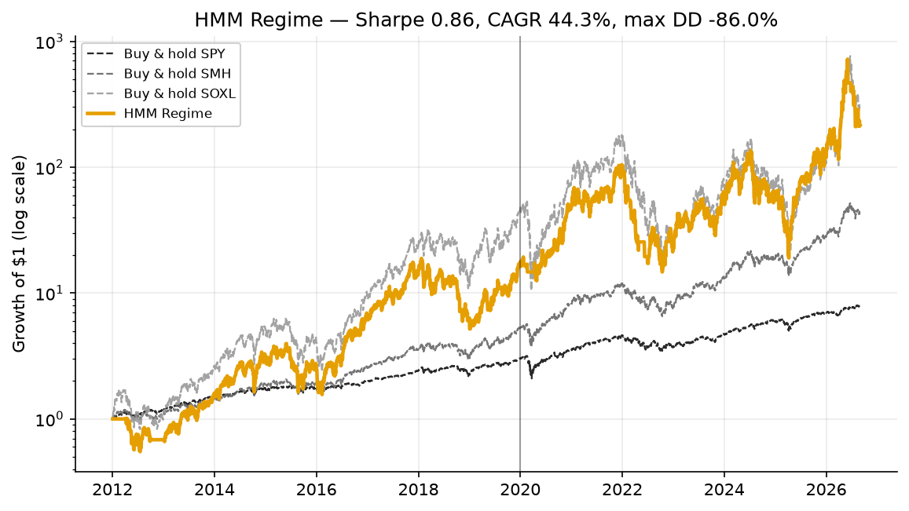

> **A strategy branch of [trading-experiments](../../tree/main).** This page is the complete
> write-up for one strategy. The shared backtest harness, setup instructions, the head-to-head
> benchmark across every signal/traded-pair strategy, and the execution notes all live on
> [`main`](../../tree/main) — this branch has that same code and (once run) would show the same
> results — it just leads with the strategy instead.
>
> Other strategies: [Donchian + Aroon](../../tree/strategy/donchian-aroon) &middot; [SMA + Momentum](../../tree/strategy/sma-momentum) &middot; [Seykota](../../tree/strategy/seykota) &middot; [EMA9 / RSI14](../../tree/strategy/ema-rsi-meanrev) &middot; [MAG7 overnight](../../tree/strategy/mag7-overnight) &middot; [Sentiment (design)](../../tree/strategy/sentiment)

# Hidden Markov Model regime detection

Implementation: [`strategies/hmm_regime.py`](strategies/hmm_regime.py)
Benchmark harness: [`run_benchmark.py`](run_benchmark.py)
Tests: [`tests/test_new_strategies.py`](tests/test_new_strategies.py)

> [!IMPORTANT]
> **Benchmarked.** This strategy is scored alongside the other four by `run_benchmark.py`, and the
> numbers are in [§4](#4-results). Headline: **Sharpe 0.86** over 2012-01-03 → 2026-08-31, against
> **0.88** for the Donchian breakout it competes with and **0.94** for simply holding SPY. It
> posts the deepest drawdown of anything in the repo (−86.0%) and the smallest in-sample to
> out-of-sample gap (0.89 → 0.88). The causal machinery in
> [§3](#3-the-look-ahead-trap-this-strategy-is-built-to-avoid) is what that second number rests
> on — a model that never saw the future in training has no in-sample advantage to lose.

---

## Contents

- [1. The strategy](#1-the-strategy)
- [2. Why a Hidden Markov Model, and what it is doing](#2-why-a-hidden-markov-model-and-what-it-is-doing)
- [3. The look-ahead trap this strategy is built to avoid](#3-the-look-ahead-trap-this-strategy-is-built-to-avoid)
- [4. Results](#4-results)
- [5. Parameters and what they trade off](#5-parameters-and-what-they-trade-off)
- [6. Limitations and risks](#6-limitations-and-risks)
- [7. Further reading](#7-further-reading)

---

## 1. The strategy

    fit a Gaussian HMM with n_states states on trailing daily log returns of SMH
    refit every refit_every trading days, on the trailing train_window days ONLY
    label the state(s) with a positive fitted mean return "bullish"
    hold SOXL while the FILTERED probability of "bullish" >= prob_thresh; else hold cash

Unlike the other four strategies in this repo, there is no chart pattern or moving-average rule
here. The model is handed nothing but a rolling window of daily returns and asked to infer, on
its own, whether the market's return-generating process currently looks more like a
"trending/calm" regime or a "choppy/turbulent" one — then the strategy trades that inference.

```python
DEFAULTS = dict(n_states=2, refit_every=63, train_window=756, prob_thresh=0.5, random_state=42)
```

Same signal/traded pair, same cost model, same warm-up, same `run(signal, traded, warmup,
**params) -> StrategyResult` interface as the other four — it drops straight into
`run_benchmark.py`'s head-to-head table once it has been run with data (`strategies/__init__.py`'s
`ALL` list and `run_benchmark.py` are already updated).

---

## 2. Why a Hidden Markov Model, and what it is doing

An HMM models a sequence as generated by an unobserved ("hidden") **state** that changes over
time, where each state has its own probability distribution over what gets observed. Concretely,
here:

- **State** ($s_t \in \{0, \dots, n\_states-1\}$): the latent market regime on day $t$ — never
  observed directly.
- **Emission distribution**: each state has its own Gaussian distribution over daily log returns —
  a mean and a variance. State 0 might turn out to have a small positive mean and low variance
  ("calm uptrend"); state 1, a negative or near-zero mean and high variance ("turbulent").
- **Transition matrix**: the probability of moving from each state to each other state (or
  staying) from one day to the next — how "sticky" a regime is.

Given a window of past returns, fitting the model (via **Expectation-Maximization**) estimates
all of the above from the data itself, with no labels and no hand-picked threshold — this is the
core appeal versus, say, a fixed "SMA(200) defines the regime" rule: the boundaries are learned,
not assumed. This is a genuinely standard technique in quantitative regime detection; §7 links
several practitioner and academic treatments, including a QuantStart walk-through that fits
exactly this kind of Gaussian HMM (via the same `hmmlearn` library used here) to S&P 500 returns.

Once fit, the "bullish" state (or states, for `n_states > 2`) is whichever has a **positive fitted
mean daily log return** — re-derived every refit, not pinned to a fixed state index, because a
refit can permute which index means what (**label switching** — see the Glossary). The strategy
then holds the traded instrument whenever the current filtered probability of being in a bullish
state clears `prob_thresh` (default 0.5), and holds cash otherwise.

---

## 3. The look-ahead trap this strategy is built to avoid

This section exists because HMM-regime blog posts and tutorials get this wrong more often than
right, and this repo cares more about provable absence of look-ahead than about any other single
property (see `main`'s methodology section). Two traps are specific to HMMs and do not arise
anywhere else in this repo:

**Trap 1 — fitting once on the whole sample.** The common tutorial pattern is: fit one HMM on all
15 years of data, decode the state sequence, and plot it against price to show how well the
regimes line up with, say, 2020 and 2022. That plot will always look great, because the model
was allowed to learn the shape of the 2020 crash and the 2022 drawdown before "predicting" them.
**This is a look-ahead leak indistinguishable, in effect, from computing a moving average with a
centered window.** `hmm_regime.py` refits every `refit_every` trading days, and every refit trains
`GaussianHMM.fit()` on a slice ending at the refit day — never later.

**Trap 2 — `hmmlearn`'s own `predict_proba` smooths.** Even with a correctly walk-forward-refit
model, the natural next step — call `model.predict_proba(returns_so_far)` and read off "today's"
row — is still wrong, because `predict_proba` runs the **forward-backward algorithm**: it uses
the ENTIRE array handed to it, in both directions, to compute each row's probability. If that
array extends even one day past "today," today's reported probability has already seen
tomorrow's return. This is subtle exactly because the code *looks* causal — the loop is written
day by day — while the library call inside it is not.

**The fix**: `_forward_filter()` hand-rolls the **forward-only** recursion instead —

$$\alpha_t(s) \;\propto\; b_s(x_t) \sum_{s'} \alpha_{t-1}(s') \, A(s', s)$$

renormalized to sum to 1 at each step, where $b_s$ is state $s$'s Gaussian density and $A$ is the
transition matrix. By construction, $\alpha_t$ depends only on observations $x_1, \dots, x_t$ —
this is the **filtering** distribution, the only one a live trader (who has never seen tomorrow)
could ever actually compute.

**How this is actually verified, not just argued.** `tests/test_new_strategies.py` runs the same
truncation proof `tests/test_no_lookahead.py` uses for the other four strategies: run the full
strategy, run it again on a series truncated partway through, and demand the overlapping days'
returns are bit-identical. `test_hmm_no_lookahead` passes at `max |diff| = 0.00e+00` on synthetic
data — not "close," exactly zero, which is what a genuinely causal pipeline should produce.
`test_hmm_forward_filter_matches_definition` independently re-derives two steps of the recursion
by hand and checks `_forward_filter` against them.

---

## 4. Results

Generated by `python run_benchmark.py --write` on 2026-09-01, from data through 2026-08-31.
Signal read from SMH and expressed in SOXL; 3,686 trading days; 5 bps/side; Sharpe at a 0%
risk-free rate; in-sample is before 2020-01-01.

| Strategy | Sharpe | IS | OOS | CAGR | Vol | Max DD | Growth | Exposure | Round trips/yr |
|---|---|---|---|---|---|---|---|---|---|
| Donchian + Aroon | **0.88** | 0.86 | 0.94 | 44.8% | 71.9% | −75.7% | 224× | 79% | 0.9 |
| **HMM regime** | **0.86** | 0.89 | 0.88 | 44.3% | 79.2% | **−86.0%** | 214× | 87% | 5.9 |
| SMA + Momentum | 0.80 | 0.86 | 0.80 | 36.3% | 71.8% | −74.2% | 92× | 76% | 4.0 |
| Seykota | 0.49 | 0.52 | 0.48 | 5.1% | 11.7% | −16.4% | 2.1× | 12% | 6.2 |
| EMA9/RSI14 mean reversion | 0.39 | 0.55 | 0.35 | 7.4% | 27.5% | −50.8% | 2.8× | 2.4% | 1.0 |
| *Buy & hold SMH* | *1.01* | *1.08* | *1.03* | *29.3%* | *29.8%* | *−45.3%* | *43×* | *100%* | — |
| *Buy & hold SPY* | *0.94* | *1.14* | *0.82* | *15.1%* | *16.5%* | *−33.7%* | *7.9×* | *100%* | — |



### It works, and it does not earn its complexity

0.86 against 0.88 for *“is today's close above the 50-day high.”* A Gaussian HMM refit 62 times
walk-forward lands a hair **behind** a two-line breakout rule, and neither clears buy-and-hold SMH
(1.01) or SPY (0.94) — the same conclusion every other strategy in this repo reaches.

### It generalised better than anything else here

IS 0.89 → OOS 0.88 is the smallest in-sample-to-out-of-sample gap in the table; compare
EMA9/RSI14's 0.55 → 0.35. Its four-year sub-period Sharpes are the steadiest column too:

| | 2012–2015 | 2016–2019 | 2020–2023 | 2024–2026\* |
|---|---|---|---|---|
| **HMM regime** | 0.70 | 1.06 | 0.81 | 0.98 |
| Donchian + Aroon | 0.71 | 0.99 | 0.88 | 1.02 |
| SMA + Momentum | 0.63 | 1.05 | 0.66 | 0.98 |

\* 2.7 years, not 4 — the data ends 2026-08-31.

That stability is the real argument for the method, and it is what §3's causal machinery buys.

### The drawdown is the problem

−86.0% is the worst of anything tested — deeper than SMA+Momentum's −74.2%, and not far from
buy-and-hold SOXL's −90.5%. At **87% exposure** to a 3× leveraged ETF this is close to simply
holding the instrument. The regime filter is switched on almost all of the time, so it removes far
less risk than a Sharpe of 0.86 suggests. Read the exposure column before the Sharpe column.

### The refits

The run reports its own fitting diagnostics, because a run where most refits failed is not the
same experiment as one where none did:

```
HMM Regime   62 refits, 0 exhausted the EM iteration cap, 27 logged a
             log-likelihood decrease, 1 skipped for insufficient history
```

62 refits against the ~58 this page estimated in advance — the estimate assumed the 3,668-bar
scoring window, whereas the refit loop runs over the full 3,937-return history including the
pre-warm-up period. The 27 log-likelihood decreases are EM oscillating at its own tolerance floor
(deltas near 1e-2 on a log-likelihood near 2e3), not failed fits. `hmmlearn` logs each as a
warning; they are counted and reported here rather than printed into the middle of the results
table. Note that `monitor_.converged` does **not** detect them — that flag is true whenever the
last improvement fell below tolerance, and a small *negative* delta satisfies that too, so the log
itself has to be counted.

Reproduce with:

```bash
pip install -r requirements.txt      # includes hmmlearn
python run_benchmark.py --write      # refresh results/, HMM regime included
python make_charts.py                # regenerate the charts
```

---

## 5. Parameters and what they trade off

| Parameter | Default | What it controls |
|---|---|---|
| `n_states` | 2 | Number of latent regimes. 2 keeps the "bullish" label unambiguous (the higher-mean state); 3+ risks a state with fitted mean near zero whose "bullish" classification is noisy from window to window. |
| `refit_every` | 63 (~1 quarter) | How often the model re-learns its regime definitions. Shorter adapts faster to a genuine regime change but re-estimates from less additional data each time and increases the chance of an unstable fit; longer is more stable but slower to notice a real shift. |
| `train_window` | 756 (~3 years) | How much trailing history each fit uses. A **rolling** window, not expanding — deliberately, since 15 years of returns are very unlikely to be statistically stationary (an HMM fit equally on 2012 and 2025 data implicitly assumes the return process hasn't changed, which is a strong and probably false assumption for a single sector ETF). |
| `prob_thresh` | 0.5 | How confident the filter must be before trading. 0.5 is the natural, unbiased default; raising it trades less often and only on higher-conviction regime reads, at the cost of missing the early part of genuine regime shifts. |
| `random_state` | 42 | `hmmlearn`'s EM fit has a random initialization; this pins it so results are exactly reproducible from the same input data, matching this repo's reproducibility standard. |

None of these have been swept against real data. They are defaults chosen from the parameters'
meaning and from common practice in the walk-forward-HMM literature (§7), not from an in-sample
optimization on this instrument pair — which matters for reading §4 in the right direction. An
unswept default is a different kind of claim than a swept-and-selected one: the 0.86 is one draw
at one seed, not a selected maximum. Given how badly naive optimisation overfits on this data (see
the Donchian+Aroon branch, where in-sample parameter selection produced *worse* out-of-sample
Sharpe), an unswept number is arguably the more honest one to publish.

---

## 6. Limitations and risks

**One pair, one seed, one parameter set (§4).** The 0.86 is a single unswept draw on SMH→SOXL with
`random_state=42`. EM is seed-sensitive on short training windows and no seed sweep was run, so
treat that number as one observation rather than a point estimate — and note that it sits inside
the gap between Donchian's 0.88 and SMA+Momentum's 0.80, which is narrow enough that seed choice
alone could reorder them.

**Two-state Gaussian HMMs on daily returns are a genuinely weak signal in practice.** The
literature (§7) is consistent that regime detection this way is real but noisy: the mean
difference between a "bull" and "bear" regime in daily log returns is typically small relative to
the day-to-day standard deviation, so the model's confidence often sits well away from 0 or 1, and
short, whipsaw-prone regime flips are common — this repo's own synthetic tests (§3) show exactly
that pattern (long stretches without a state flip, punctuated by occasional deep exposure
[0,100]% clips) even on a fabricated series constructed to have obvious regime structure.

**Refitting is itself a source of instability, not just adaptability.** Every refit is a fresh EM
fit that can converge to a different local optimum, or — with `n_states > 2` — assign more than
one state a positive mean, degrading the binary "bullish" read. `signals()` catches a fit that
raises `ValueError` on a degenerate window (e.g. near-zero variance) and skips it, defaulting to
flat, but does not detect a fit that "succeeds" numerically while producing a poor regime
separation. A parameter sweep and a stability check (e.g., does the classification for a given day
change much depending on exactly which day the most recent refit happened to land on?) are the
natural next steps once real data is available.

**`train_window=756` with `refit_every=63` means the model only ever sees ~3 years of history at
once.** That is long enough to span some cyclical variation but is far short of a full economic
cycle, let alone the sector-specific 2012–2026 semiconductor supercycle the rest of this repo is
built on (see `main`'s "Known limitations"). A regime read from 2015–2018 data is a read on a very
different market than one from 2020–2023.

**The forward filter resets at every refit rather than carrying probability continuity across a
parameter change (§3).** This is a deliberate simplification to sidestep label-switching, not a
free lunch — it means the first few observations after every refit are scored against a fairly
uninformative prior (`startprob_`) rather than genuine accumulated confidence, which very slightly
understates how quickly the strategy should be able to react right after a refit.

**Same daily-close-fill, cost, and single-sector-single-instrument limitations as the rest of this
repo** — see `main`'s "Known limitations" section, all of which apply unchanged here.

---

## 7. Further reading

Found via general web search during this session (not fetched into the repo):

- [Market Regime Detection using Hidden Markov Models in QSTrader — QuantStart](https://www.quantstart.com/articles/market-regime-detection-using-hidden-markov-models-in-qstrader/) — a walk-through fitting a Gaussian HMM (via `hmmlearn`) to S&P 500 returns, and explicitly noting that a production system would need to periodically retrain since regime parameters are unlikely to be stationary — the same conclusion this branch's walk-forward design starts from.
- [Hidden Markov Models — An Introduction — QuantStart](https://www.quantstart.com/articles/hidden-markov-models-an-introduction/) — background on the forward algorithm, forward-backward, and Viterbi decoding referenced in §3 and the Glossary.
- [Regime-Switching Factor Investing with Hidden Markov Models — MDPI](https://www.mdpi.com/1911-8074/13/12/311) — an academic treatment of switching between different investment models by detected regime, rather than just switching exposure on/off as this strategy does.
- [Statistical identification with hidden Markov models of large order splitting strategies in an equity market (arXiv)](https://arxiv.org/pdf/1003.2981) — a different but related use of HMMs in market microstructure, useful context for how broadly the technique is applied in finance beyond regime timing.

---

## Glossary

Abbreviations used on this page. The repo-wide list, covering every term used anywhere in this
project — including the full Hidden Markov Model section this page draws on — is in
[`GLOSSARY.md`](GLOSSARY.md), available on every branch.

| Term | Definition |
|---|---|
| **HMM** | Hidden Markov Model — a model of a sequence generated by an unobserved state that changes over time, where each state emits observations from its own distribution. |
| **State / regime** | One of a small number of latent conditions the model believes the market can be in. Never observed directly, only inferred. |
| **Emission distribution** | The distribution a state generates observations from — Gaussian (mean + variance) here. |
| **Transition matrix** | The probability of moving from each state to each other state from one day to the next. |
| **Filtering** | Estimating the CURRENT state's probability using only past and present observations — the only estimate a live strategy can actually compute. |
| **Smoothing** | Estimating a PAST state's probability using the entire sequence, including later observations — a look-ahead leak if used for a live decision. |
| **Forward algorithm** | The recursion that computes the filtering distribution causally, one observation at a time. |
| **Forward-backward algorithm** | The combined recursion computing the smoothing distribution; `hmmlearn.predict_proba` implements this, which is why it isn't used directly here. |
| **Expectation-Maximization (EM)** | The iterative algorithm used to fit an HMM's parameters to data. |
| **Label switching** | The fact that state indices carry no fixed meaning across separate fits — re-derived here every refit via "positive fitted mean = bullish," rather than trusted by index. |
| **Walk-forward refit** | Periodically re-fitting a model using only data available up to that point, rather than fitting once on the whole sample. |
| **Sharpe ratio** | Return per unit of volatility, at a 0% risk-free rate. ~1.0 is respectable. |
| **CAGR** | Compound Annual Growth Rate. |
| **IS / OOS** | In-sample vs out-of-sample; see `main`'s methodology section. |
| **Stateless signal** | A signal that depends only on today's data, not on whether a position is currently held — true of this strategy, same as SMA+Momentum. |
