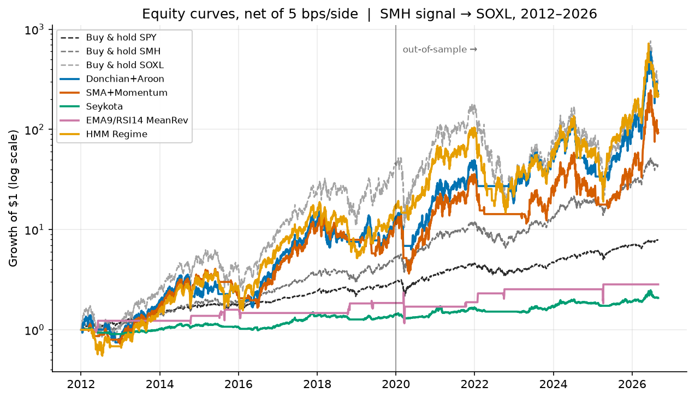
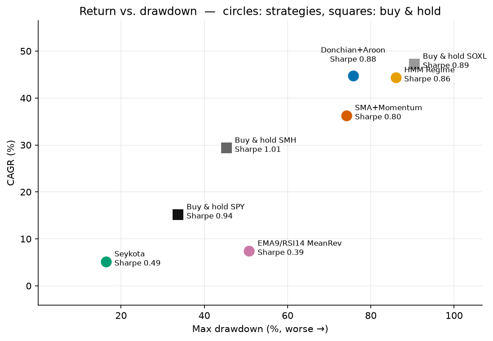
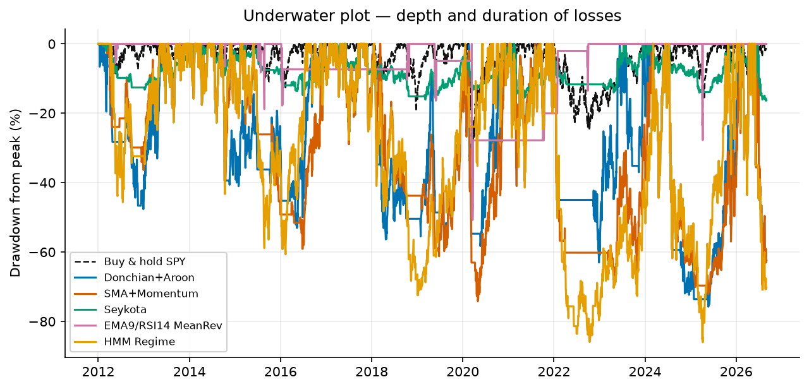
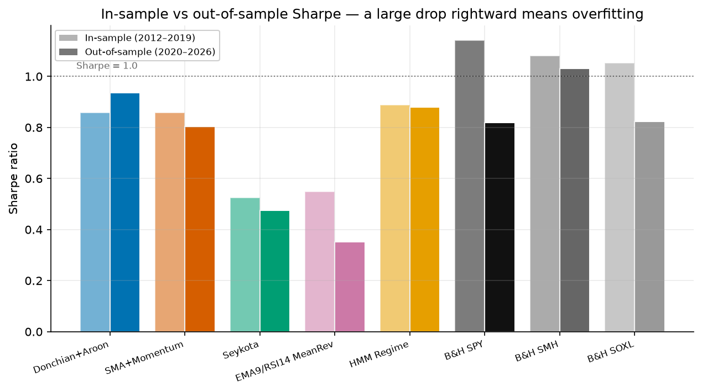
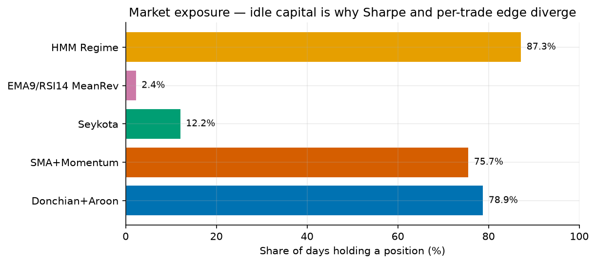
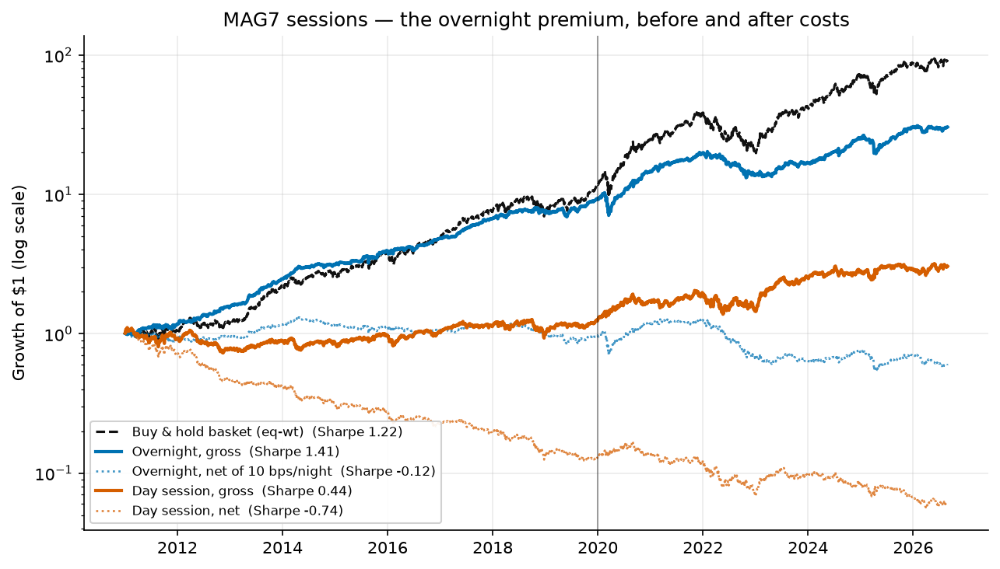

# trading-experiments

Open research notes on **systematic trading strategies**, with a reproducible backtest harness.

This is a personal learning project: a place to test trading ideas properly and write down what
they actually did. Every number here is generated by `python run_benchmark.py --write` from the
code in this repo, so anything you see can be re-run and checked for yourself.

> [!IMPORTANT]
> **This is research, not a trading system, and not financial advice.** Nothing here is wired to
> a broker. The execution artifacts under [`deploy/`](deploy/) are deliberately pseudocode and
> placeholders. Backtests are a measurement of the past under stated assumptions; they are not a
> forecast. Leveraged instruments appear throughout and the drawdowns are severe.

---

## The strategies

**Each strategy lives on its own branch, and that branch's landing page *is* its write-up.**
Click any branch below and GitHub renders the full deep-dive immediately — the strategy, the
math, expected results, recommended setup, the research behind it, and its limitations. There is
nothing else to go looking for.

| Branch | Strategy | One-line summary |
|---|---|---|
| [`strategy/donchian-aroon`](../../tree/strategy/donchian-aroon) | **Donchian breakout + Aroon filter** | Buy above the 50-day high, sell below the 63-day low, gated by an Aroon trend filter |
| [`strategy/sma-momentum`](../../tree/strategy/sma-momentum) | **200-day SMA + 12-month momentum** | Hold while price is above its 200-day average *and* the 12-month return is positive |
| [`strategy/seykota`](../../tree/strategy/seykota) | **Seykota ATR risk-sizing** | 50/200 EMA trend, position sized to risk 2% of equity at an ATR stop, ATR trailing exit |
| [`strategy/ema-rsi-meanrev`](../../tree/strategy/ema-rsi-meanrev) | **EMA(9) / RSI(14) mean reversion** | Buy oversold dips below the 9-day EMA, exit when price reverts above it |
| [`strategy/hmm-regime`](../../tree/strategy/hmm-regime) | **Hidden Markov Model regime detection** | Walk-forward-refit Gaussian HMM infers a bull/bear regime probability from returns; hold while the filtered probability of "bullish" clears a threshold |
| [`strategy/mag7-overnight`](../../tree/strategy/mag7-overnight) | **MAG7 overnight (close-to-open)** | Buy the Magnificent Seven at the close, sell at the next open, every name, every night |
| [`strategy/sentiment`](../../tree/strategy/sentiment) | **Sentiment analysis** — *design only* | Not implemented and not benchmarked: a system-design scaffold covering data feeds, execution, latency and cost |
| [`research/equity-pipeline`](../../tree/research/equity-pipeline) | **Equity research pipeline** — *scaffold* | A different kind of work entirely: a 5-stage fundamental screen of the ~1,000 largest US companies, ending in portfolio construction. Awaiting a re-run before results are published |

**All six are implemented and benchmarked**, every number below generated from this code.
Five of them — everything except MAG7 overnight — are scored side by side by
`run_benchmark.py` on identical bars; MAG7 overnight trades a basket of seven individual
names on a close-to-open schedule rather than one signal instrument expressed through
another, so it has its own harness, `run_mag7_overnight.py`, and its own table further down.

`strategy/sentiment` and `research/equity-pipeline` are the two genuine exceptions: they are
deliberately plans and scaffolds with no code behind them, so there are **no performance
numbers for either anywhere in this repo**, and their own landing pages say so rather than
presenting placeholders as real.

Note that `research/equity-pipeline` is a different discipline from everything else here. The
six strategies are **systematic timing rules**, judged by backtest. The equity pipeline is
**fundamental stock selection** across a wide universe, judged by portfolio construction. They
share a repo because they share a research standard, not a method.

**How the branches are organised.** `main` is the home you are reading now: the shared harness,
all six implementations, the head-to-head benchmark, and the execution notes. Every strategy
branch contains all of that too — it is `main` plus one commit — so the code and results are
identical on every branch. The only difference is the landing page, which each branch replaces
with its own write-up. So:

- Want to **compare** strategies, run the benchmark, or read the methodology → stay on `main`.
- Want to **understand one** strategy in depth → open its branch and start reading.

---

## Headline results

Signal read from **SMH** (VanEck Semiconductor ETF), expressed in **SOXL** (3× semiconductors).
2012-01-03 → 2026-08-31, 3,686 trading days, 5 bps/side costs, Sharpe at a 0% risk-free rate.
In-sample is before 2020-01-01; out-of-sample is 2020 onward.

| Strategy | Sharpe | IS | OOS | CAGR | Vol | Max DD | Growth | Exposure | Round trips/yr |
|---|---|---|---|---|---|---|---|---|---|
| **Donchian + Aroon** | **0.88** | 0.86 | 0.94 | 44.8% | 71.9% | −75.7% | 224× | 79% | 0.9 |
| HMM regime | 0.86 | 0.89 | 0.88 | 44.3% | 79.2% | −86.0% | 214× | 87% | 5.9 |
| SMA + Momentum | 0.80 | 0.86 | 0.80 | 36.3% | 71.8% | −74.2% | 92× | 76% | 4.0 |
| Seykota (ATR-sized) | 0.49 | 0.52 | 0.48 | 5.1% | 11.7% | **−16.4%** | 2.1× | 12% | 6.2 |
| EMA9/RSI14 mean reversion | 0.39 | 0.55 | 0.35 | 7.4% | 27.5% | −50.8% | 2.8× | 2.4% | 1.0 |
| *Buy & hold SOXL* | 0.89 | 1.05 | 0.82 | 47.2% | 91.8% | −90.5% | 286× | 100% | — |
| *Buy & hold SMH* | **1.01** | 1.08 | 1.03 | 29.3% | 29.8% | −45.3% | 43× | 100% | — |
| *Buy & hold **SPY** (S&P 500)* | 0.94 | 1.14 | 0.82 | 15.1% | 16.5% | −33.7% | 7.9× | 100% | — |

Four-year sub-period Sharpe, as a consistency check across regimes. The last block is marked
`*` because it holds 2.7 years, not 4 — the data ends in August 2026:

| Strategy | 2012–2015 | 2016–2019 | 2020–2023 | 2024–2026* |
|---|---|---|---|---|
| Donchian + Aroon | 0.71 | 0.99 | 0.88 | 1.02 |
| HMM regime | 0.70 | 1.06 | 0.81 | 0.98 |
| SMA + Momentum | 0.63 | 1.05 | 0.66 | 0.98 |
| Seykota | 0.23 | 0.76 | 0.46 | 0.50 |
| EMA9/RSI14 mean reversion | 0.79 | 0.32 | 0.41 | 0.27 |
| *Buy & hold SMH* | 0.92 | 1.22 | 0.82 | 1.34 |
| *Buy & hold SPY* | 1.18 | 1.11 | 0.62 | 1.30 |

Full generated output: [`results/benchmark.md`](results/benchmark.md).

### MAG7 overnight

Scored separately, because it is a different kind of thing: seven individual names, held from
each close to the next open, every night, equal-weighted across whichever have listed yet.
2011-01-03 → 2026-08-28, 3,937 nights, 5 bps/side on **both** legs of every night.

| Leg | Sharpe | IS | OOS | CAGR | Vol | Max DD | Growth |
|---|---|---|---|---|---|---|---|
| MAG7 overnight (close → open) | −0.12 | 0.04 | −0.27 | −3.3% | 16.5% | −59.5% | 0.60× |
| *Day session (the part it skips)* | −0.74 | −1.16 | −0.35 | −16.5% | 21.3% | −94.8% | 0.06× |
| *Buy & hold the basket, equal-weight* | **1.22** | 1.34 | 1.15 | 33.6% | 26.7% | −49.4% | 93× |

Those net numbers are almost entirely an artefact of the cost assumption, so the split matters
more than the total:

| Leg | Sharpe | CAGR | Growth |
|---|---|---|---|
| Overnight, **gross** of costs | **1.41** | 24.5% | 30.5× |
| Overnight, net of 10 bps/night | −0.12 | −3.3% | 0.60× |
| Day session, **gross** | 0.44 | 7.4% | 3.06× |
| Day session, net | −0.74 | −16.5% | 0.06× |

Full generated output: [`results/mag7_overnight.md`](results/mag7_overnight.md).

### Charts

Growth of $1, log scale — so equal vertical distances are equal percentage moves and the slopes
can be compared directly. On a linear axis the 224× outcome would flatten everything else onto
the floor.



The same story told as risk. The vertical axis is return, the horizontal axis is the worst loss
you had to sit through to get it — up and to the *left* is better.



Drawdowns over time. This is the chart that shows what holding these actually felt like: the
leveraged strategies spend years underwater, while SPY's worst moment is shallower than the
leveraged strategies' *typical* one.



In-sample against out-of-sample Sharpe. A bar that collapses from left to right was fitted to
the first half and did not generalise — the mean-reversion strategy is the clearest case.



Share of days actually holding a position. This single chart explains most of the Seykota and
mean-reversion results: a strategy that is in the market 2.4% of the time earns nothing on the
other 97.6%, no matter how good its trades are.



MAG7 overnight gets its own chart rather than a line on the one above, because it trades seven
individual names on a close-to-open schedule — different instruments, a different calendar, and
a comparison against SMH/SOXL that nobody is actually making. What it does show is the whole
finding in one picture: the night line and the day line multiply back to the buy-and-hold line,
and essentially all of the basket's fifteen-year return happened while the market was shut.



Regenerate all of these with `python make_charts.py`.

### What these results actually say

Taken together, the conclusions are more modest than the top row suggests:

- **Nothing here beat buying and holding an index.** SMH scores 1.01 and **plain SPY scores
  0.94** — both above the best strategy in the table. Every leveraged strategy bought extra CAGR
  with a more-than-proportional increase in drawdown: Donchian earns 3× SPY's return for 2.2× its
  drawdown *and* a worse Sharpe. If risk-adjusted return is the objective, the honest answer this
  repo produces is "buy the index". The strategies are only interesting if you have explicitly
  decided to accept a −75% drawdown in exchange for absolute return.
- **The Donchian result is the good corner of its parameter neighbourhood, not its centre.**
  Across the 48 nearby parameter sets the median Sharpe is 0.83, against 0.81 for the incumbent.
  Selecting parameters on the in-sample peak instead produced out-of-sample Sharpe of 0.68–0.71 —
  naive optimisation actively overfits on this data.
- **The robust findings are structural, not statistical:** the exit-channel length dominates
  everything else, and the breakout model trades ~4× less than the SMA model — which matters for a
  small cash account under T+1 settlement far more than the ~0.3%/yr of direct cost it saves.
- **The Aroon market filter did not earn its keep.** Implemented faithfully from the source post,
  it is mathematically inert whenever its lookback is ≤ the entry channel (a new *N*-day-high close
  pins AroonUp at 100, so it can never veto an entry). Configurations where it *does* bind scored
  worse (0.81 vs 0.90). The winning configuration is therefore effectively a pure Donchian
  breakout, which makes this a negative result for the filter — worth recording either way.
- **Seykota's poor CAGR here is a mandate mismatch, not a refutation.** Its 2% risk rule is built
  for a diversified multi-market book; applied to one leveraged instrument it holds ~88% cash. It
  posted by far the best drawdown (−16.1%) of anything tested.
- **Sharpe is close to the wrong metric for the mean-reversion strategy.** It scores worst in the
  table (0.39), yet its 15 trades averaged **+7.6% each with a t-statistic of 3.6** and an 86.7%
  win rate. The two facts are consistent: it is in the market only 2.4% of days, so it earns
  exactly zero on the other 97.6% and the equity-curve Sharpe collapses. The problem is capital
  efficiency, not a broken signal — though with only 15 trades the sample is very thin.
- **Closed-trade statistics hide path risk.** That same strategy, despite 2.4% exposure and a
  worst closed trade of −8%, still went through a **−50.8% drawdown** — all of it inside a single
  March 2020 trade that ran +27% to −37% before closing at −8%. Sizing off a trade table alone
  would have been badly misleading.
- **The HMM buys its Sharpe with drawdown, and lands where the simple rules already were.** At
  0.86 it is a hair behind the Donchian breakout's 0.88 on far more machinery — a Gaussian HMM
  refit 62 times walk-forward, against "is today's close above the 50-day high". It is also the
  *worst* drawdown of any strategy tested (−86.0%, deeper than SMA+Momentum's −74.2%), because
  87% exposure on a 3× ETF is close to just holding it. Its consistency across sub-periods is
  genuinely good (0.70 / 1.06 / 0.81 / 0.98, the steadiest column in the table) and its IS→OOS
  gap is the smallest of anything here — but the honest reading is that a latent-regime model
  rediscovered the trend filter the cheap indicators already provide.
- **The overnight effect is large, real, and completely eaten by costs.** MAG7 overnight is the
  best gross risk-adjusted return anywhere in this repo — **Sharpe 1.41, 24.5% CAGR** — and
  net of 5 bps a side it is **−0.12 and −3.3%**. The two gross legs multiply back to the
  buy-and-hold basket (30.5× overnight × 3.06× day = 93× ≈ the 93× of holding it), so the
  decomposition is arithmetically exact: **essentially all of the Magnificent Seven's fifteen-year
  return arrived overnight, and the day session contributed almost nothing.** That is a genuine
  and well-documented market fact. It is also untradeable here: round-tripping every name every
  night costs ~22%/yr at this cost model, and **the leg breaks even at 4.6 bps/side against the
  5 bps charged**. The sign of that row is decided in the third decimal place of a cost
  assumption, which is exactly why it is reported gross *and* net rather than as one number.

---

## Methodology

The parts that determine whether a backtest means anything:

- **No look-ahead.** Signals use data up to and including today's close; the resulting position
  earns **tomorrow's** return. Channel highs/lows are `.shift(1)`-ed so today's bar is never part
  of its own channel. Implemented once, in `common/engine.py`, rather than per strategy.
- **Identical scoring.** All five signal-pair strategies run on the same bars, the same warm-up
  (252 days), the same cost model, through the same metrics code. Differences in the table are
  differences in strategy, not in harness. The buy-and-hold columns are reindexed onto that same
  calendar and the reindex is *checked* rather than assumed — a scoring day with no price raises
  instead of being filled with a fabricated 0% return.
- **Walk-forward fitting, for the one strategy that fits anything.** The HMM is the only model
  here with parameters learned from data, so it is the only one that can overfit by fitting. It
  is refit every 63 trading days on a trailing 756-day window, and every refit trains strictly on
  data up to and including the refit day. Its state probabilities come from a hand-rolled forward
  filter rather than `hmmlearn.predict_proba`, which runs forward-*backward* and would let
  tomorrow's return inform today's position. `tests/test_new_strategies.py` proves the difference
  by truncation. The run reports how many of its 62 refits converged.
- **MAG7 overnight books a return that today's close cannot determine.** Every other strategy
  earns a return fully determined by data up to day *t*'s close; an overnight return needs day
  *t+1*'s open by definition. That is a convention difference, not a look-ahead leak — the
  decision to trade depends on nothing at all, since the strategy is in every name every night —
  but it is why that strategy is scored in its own harness and reported in its own table.
- **Costs.** 5 bps per side on every position change, modelling spread and slippage. These are
  liquid ETFs and commissions are zero at most retail brokers. That assumption is nearly
  irrelevant to strategies trading ~1–6 round trips a year and *decisive* for one trading 252 —
  MAG7 overnight breaks even at 4.6 bps against the 5 bps charged, so it is reported gross and
  net side by side rather than as a single number that a rounding choice could flip.
- **Data.** Split- and dividend-adjusted daily closes from Yahoo Finance via `yfinance`. SOXL has
  split repeatedly, so adjusted prices are mandatory — raw closes would fabricate huge losses.
- **Metrics.** Sharpe uses annualised arithmetic mean daily return over annualised daily standard
  deviation, at a 0% risk-free rate. CAGR is geometric. Max drawdown is on daily closes, so real
  intraday drawdowns were worse.
- **Cash earns 0%, and that is not neutral.** It penalises whichever strategy holds the most cash.
  Seykota sits ~88% in cash, so at a realistic 2–4% on idle balances its returns would improve
  materially while the near-fully-invested strategies would barely move. This does not change the
  ranking — the gap is far too large — but any comparison that turns on a few points of CAGR
  should re-run with `rf_annual` set appropriately.
- **Out-of-sample split.** 2012–2019 in-sample, 2020–2026 out-of-sample, reported separately
  everywhere. A strategy whose OOS half collapses was fitted, not discovered.

### Known limitations

- **One sector, one regime.** 2012–2026 was the best semiconductor decade in history. These
  results will not necessarily generalise, and certainly not repeat.
- **Daily-close fills.** No intraday modelling, no gap handling, no partial fills, no borrow.
- **Survivorship-free but narrow.** SMH and SOXL both existed for the whole window, so there is
  no survivorship bias — but a two-instrument test is not a broad study.
- **Leveraged-ETF decay.** SOXL resets 3× daily and bleeds in choppy tape. This is captured in
  the price data used, but it means naive "3× the index" intuitions do not apply.
- **Sharpe is a poor summary here.** These return distributions are fat-tailed and skewed; a
  single ratio hides a great deal. It is used because it was the stated selection criterion.
- **The last sub-period block is short.** 2024–2026 holds 2.7 years against the other blocks' 4,
  so its Sharpe is estimated from fewer bars and is marked `*` wherever it appears.
- **One HMM seed.** The regime model is fit with a fixed `random_state`, so the published run is
  reproducible — but EM is seed-sensitive on short windows, and no seed sweep was run. Treat its
  0.86 as one draw, not a point estimate.

---

## Running it

```bash
git clone https://github.com/bandlayash/trading-experiments.git
cd trading-experiments
pip install -r requirements.txt

python run_benchmark.py                    # print the tables (five signal-pair strategies)
python run_benchmark.py --write            # regenerate results/
python run_benchmark.py --signal SPY --trade SPY   # try another instrument pair

python run_mag7_overnight.py               # MAG7 overnight, separate harness — see below
python run_mag7_overnight.py --write
python run_mag7_overnight.py --tickers AAPL MSFT NVDA   # any basket you like
```

First run downloads price history and caches it under `data/cache/` (git-ignored). Later runs are
offline and fast. The cache key carries the date it was fetched, so an open-ended request picks up
new bars the next day instead of silently re-serving yesterday's; superseded files are pruned as
they are replaced. Delete the directory to force a full refresh.

Using a strategy directly:

```python
from common import load_pair, perf_stats
from strategies import donchian_aroon

signal, traded = load_pair("SMH", "SOXL")
result = donchian_aroon.run(signal, traded, exit_len=80)   # override any parameter
print(perf_stats(result.daily_ret))
```

Every signal/traded-pair strategy module exposes the same interface — `NAME`, `DEFAULTS`, and
`run(signal, traded, warmup=252, **params) -> StrategyResult` — so adding another is a matter of
writing one file and adding it to `strategies/__init__.py`. `strategies/mag7_overnight.py` is the
one exception: it trades a basket of individual names on a close-to-open schedule rather than one
signal/traded pair, so it is scored by its own `run_mag7_overnight.py` instead of
`run_benchmark.py` — see that module's docstring for why.

Regenerating the charts, and checking the docs render correctly:

```bash
python make_charts.py                 # rebuild results/charts/*.png
python tests/test_no_lookahead.py     # prove no strategy can see the future (needs price data)
python tests/test_new_strategies.py   # same proof for HMM + MAG7, on synthetic data, offline
python tests/check_markdown.py        # tables balanced, links resolve, mermaid parses
```

---

## Execution options

If you ever wanted to run something like this for real, [`deploy/`](deploy/) walks through the
realistic hosting choices — local cron, GitHub Actions, AWS Lambda, a small always-on VM, and
broker-native platforms — with the trade-offs of each, plus the operational requirements
(idempotency, position reconciliation, kill switch, alerting) that matter more than the host you
pick.

Those files are **pseudocode and templates by design**. This repo does not place orders.

---

## Repo layout

```
trading-experiments/
├── common/                 # shared harness — used identically by every strategy
│   ├── data.py             #   price + OHLC loading, on-disk cache
│   ├── engine.py           #   result type, cost model, no-look-ahead convention
│   └── metrics.py          #   Sharpe / CAGR / drawdown / IS-OOS splits
├── strategies/
│   ├── donchian_aroon.py   #   breakout + Aroon filter
│   ├── sma_momentum.py     #   200-day SMA + 12-month momentum
│   ├── seykota.py          #   EMA trend + ATR risk sizing
│   ├── ema_rsi_meanrev.py  #   EMA(9)/RSI(14) mean reversion
│   ├── hmm_regime.py       #   walk-forward Gaussian HMM regime detection
│   └── mag7_overnight.py   #   MAG7 close-to-open basket (own harness, see below)
├── deploy/                 # execution options + placeholder runner (not live code)
├── results/                # generated: benchmark.md, mag7_overnight.md, summary.csv, equity_curves.csv
│   └── charts/             #   generated PNGs, rebuilt by make_charts.py
├── tests/
│   ├── test_no_lookahead.py    # truncation proof + metric/RSI edge cases (needs live data)
│   ├── test_new_strategies.py  # same proof for HMM regime + MAG7 overnight, on synthetic data
│   └── check_markdown.py       # catches tables, links and mermaid that break on GitHub
├── run_benchmark.py        # the signal/traded-pair head-to-head that produces results/
├── run_mag7_overnight.py   # the separate MAG7 overnight harness
├── make_charts.py          # every chart published in this repo
├── GLOSSARY.md             # every abbreviation used anywhere, defined
└── requirements.txt
```

---

## Glossary

Finance writing is dense with abbreviations, and this repo uses a lot of them — Sharpe, CAGR,
IS/OOS, ATR, RSI, GFV, T+1, bps, PIT. **[`GLOSSARY.md`](GLOSSARY.md) defines every one of them**,
in plain language and assuming no prior finance knowledge. It covers performance metrics,
indicators, instruments and tickers, account mechanics, research methodology, and the NLP terms
used on the sentiment branch.

It is available on every branch, so whichever page you land on, the definitions are one click
away. The most load-bearing few:

| Term | Short definition |
|---|---|
| **Sharpe ratio** | Return per unit of volatility. ~1.0 is respectable; higher is better |
| **CAGR** | Compound annual growth rate — the average yearly compounded return |
| **Max drawdown** | Worst peak-to-trough loss. −75% means the account fell to a quarter of its high |
| **IS / OOS** | In-sample (2012–2019, used for tuning) vs out-of-sample (2020–2026, held back) |
| **bps** | Basis points — hundredths of a percent. 5 bps = 0.05% |
| **Exposure** | Share of days actually holding a position rather than sitting in cash |
| **Round trip** | One complete buy-then-sell cycle (two trades) |

---

## Notes and corrections

Feedback is genuinely welcome, especially on methodology. If you spot something that looks off —
a look-ahead leak, a cost assumption that flatters a result, a metric that doesn't mean what I
think it means — I'd love to hear about it. Feel free to open an issue; including the output you
got from re-running makes it much easier to chase down.
