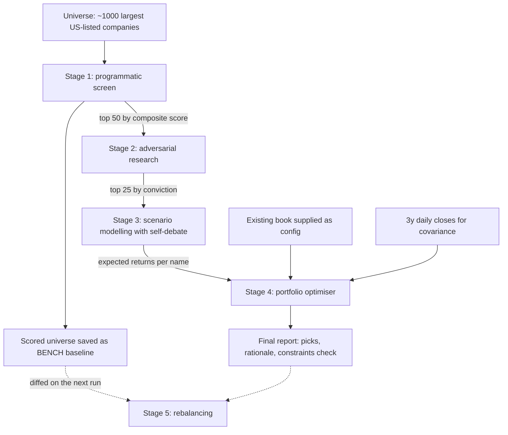

> **A research branch of [trading-experiments](../../tree/main).** This page describes one
> research programme. The shared backtest harness, the strategy comparison, and the execution
> notes live on [`main`](../../tree/main) — this branch has that same code, it just leads with
> this research instead.
>
> Strategies: [Donchian + Aroon](../../tree/strategy/donchian-aroon) &middot; [SMA + Momentum](../../tree/strategy/sma-momentum) &middot; [Seykota](../../tree/strategy/seykota) &middot; [EMA9 / RSI14](../../tree/strategy/ema-rsi-meanrev) &middot; [Sentiment (design)](../../tree/strategy/sentiment)

# Equity research pipeline — a 5-stage fundamental screen ending in portfolio construction

> [!IMPORTANT]
> **This branch is a scaffold. Nothing here has been re-run, and no results are published.**
>
> - There are **no picks, no expected returns, and no performance figures** on this page. The
>   pipeline has been run once before, privately; those outputs are deliberately not reproduced
>   here because they are stale and were never prepared for publication.
> - **Personal portfolio data is excluded on purpose.** The pipeline takes an existing book as
>   config, and that config contains real holdings, position sizes, and an account value. None
>   of it appears anywhere in this repo, and none of it should. See §1.3.
> - What follows describes **what this branch will contain** once the pipeline is re-run and its
>   outputs are sanitised.

---

## Contents

- [1. What this branch is](#1-what-this-branch-is)
- [2. The pipeline at a glance](#2-the-pipeline-at-a-glance)
- [3. The five stages](#3-the-five-stages)
- [4. Engineering constraints worth preserving](#4-engineering-constraints-worth-preserving)
- [5. Planned layout for this branch](#5-planned-layout-for-this-branch)
- [6. Re-run checklist and what gets published](#6-re-run-checklist-and-what-gets-published)
- [7. Limitations](#7-limitations)
- [8. Glossary](#8-glossary)

---

## 1. What this branch is

A five-stage pipeline that screens roughly the largest 1,000 US-listed companies on
fundamentals, stress-tests the survivors against fresh news from both directions, builds
probability-weighted scenario models for the best of them, and then runs a portfolio optimiser
to choose a small number of **new** positions that complement an existing book rather than
duplicating it.

### 1.1 How it differs from every other branch in this repo

This is a different discipline, and conflating the two would be the easiest way to misread it.

| | The four strategy branches | This branch |
|---|---|---|
| **What is decided** | *When* to hold one instrument | *Which* companies to own |
| **Universe** | One signal instrument, one traded instrument | ~1,000 US-listed companies |
| **Input data** | Adjusted daily closes | Fundamentals, prices, analyst data, live news |
| **Method** | A deterministic rule over price | Screening, research, judgement, optimisation |
| **Evidence standard** | Backtest over 14 years, with an out-of-sample split | Forward-looking portfolio construction, checked against a benchmark |
| **What can be proven** | That the rule would have produced these returns | That the modelled portfolio beats a benchmark **under stated assumptions** |
| **Failure mode** | Overfitting to price history | Overconfident scenario probabilities |

### 1.2 A backtest Sharpe is not the deliverable here

Stage 4 does compute a Sharpe ratio, and it is important not to confuse it with the numbers on
the strategy branches.

- On the strategy branches, Sharpe is **realised**: it is measured from 3,668 days of actual
  historical returns the rule would have earned.
- Here, Sharpe is **modelled and forward-looking**: expected returns come from scenario models
  and CAPM, and risk comes from a historical covariance matrix. It is a statement about
  expectations under assumptions, not a measurement of what happened.

The two are not comparable, and this branch will never present them side by side as though they
were. The deliverable here is a defensible portfolio with its reasoning attached — not a
performance record.

### 1.3 Privacy: what is deliberately missing

The pipeline's config includes the owner's real holdings with share counts, from which the
optimiser derives dollar weights, and an account value. That is genuinely personal financial
information, and this is a public repository.

Everywhere the existing book matters below, it is described abstractly: *the existing holdings
are supplied as config so the optimiser can select positions that diversify against them.* The
concentration the optimiser corrects for is described by its character, not by its contents.

**Before any future run's outputs are published here, they must be sanitised.** The raw stage
outputs embed holdings and dollar values in several places at once — `data/existing_portfolio.csv`,
the weights and value fields inside `stage4_portfolio/additions.json`, the before-and-after
comparison, and the final report's executive summary. Sanitising means removing all of them, and
converting any dollar figures to relative weights. This is a checklist item in §6, not an
afterthought.

---

## 2. The pipeline at a glance



The dotted edges are the loop: Stage 1's full scored universe is retained as a baseline so that
a later run can measure what changed rather than starting from scratch.

---

## 3. The five stages

### 3.1 Stage 1 — Programmatic screening

Scores the entire universe in code. No agent hand-scores 1,000 names.

**In:** fundamentals for the universe plus three years of daily closes.
**Out:** `full_universe_scored.csv` — every ticker with sub-scores, retained as the **BENCH**
baseline — and `top_50.csv`, the names that advance with a one-line reason each.

Each metric is winsorised at the 2nd and 98th percentiles, then z-scored **within its sector**
where the sector has at least 12 names, falling back to a universe-wide z-score otherwise. A
missing metric scores neutral rather than penalising the company. Metrics roll up into six
pillars, which are weighted into a composite and percentile-ranked onto a 0–100 scale:

| Pillar | Weight | Representative metrics |
|---|---|---|
| Quality | 0.22 | Return on equity and assets, gross, operating, net and FCF margins |
| Growth | 0.20 | Revenue growth, earnings growth, forward EPS growth implied by the PE spread |
| Valuation | 0.18 | Trailing and forward PE, EV/EBITDA, price/sales, price/FCF, PEG, price/book |
| Analyst | 0.18 | Consensus rating, implied upside to mean target, number of analysts covering |
| Balance sheet | 0.12 | Net debt to EBITDA, debt to equity, current and quick ratios, positive FCF |
| Momentum | 0.10 | 3, 6 and 12-month returns, distance from the 52-week high |
| News | 0.00 | Deliberately zero — the news treatment belongs in Stage 2 |

Valuation and leverage metrics enter with a negative sign, so cheaper and less indebted scores
higher. Eligibility for the shortlist requires an equity quote type, a known sector, a positive
price, US domicile, at least five of the core metrics present, and **exclusion of anything
already held**, so that the output is genuinely new names.

**What could go wrong.** Sector z-scoring is only as good as the sector labels. A thin sector
falls back to a universe comparison that is not really like-for-like. Treating missing data as
neutral systematically advantages companies with poor data coverage, which the coverage floor
only partly offsets. And the valuation pillar rewards cheapness without asking why something is
cheap — that question is Stage 2's job.

### 3.2 Stage 2 — Adversarial research

Every shortlisted name gets **both** a bull and a bear treatment, researched independently, and
restricted to news from the last seven days on the reasoning that older information is already
in the price. Each thesis must give three to five points, each tied to a specific dated item
with a source. Undated claims are not accepted.

The two sides are then put head to head per stock, producing a written synthesis, a net verdict,
and a **conviction score out of 100**. Candidates are ranked by conviction and the top 25
advance.

**In:** the shortlist. **Out:** a markdown file per stock with the bull case, bear case and
synthesis, plus `ranked_candidates.csv` carrying conviction and an advance flag.

**What could go wrong.** A seven-day news window is a strong assumption — it is a reasonable
prior for liquid large caps and a poor one for slow-moving theses. Conviction is a judgement
score, so it inherits whatever bias the researcher brings, and the bull and bear cases are only
as balanced as the effort put into each. Sparse news coverage produces a thin case in either
direction, which the conviction score does not currently distinguish from a genuinely balanced one.

### 3.3 Stage 3 — Scenario modelling with mandatory self-debate

The most important stage, and the one most exposed to wishful thinking, which is why the
red-team step is not optional.

For each of the 25 advancers:

1. Build **bull, base and bear** scenarios. Each gets a probability, a short narrative, and a
   12-month price target. Probabilities must sum to one.
2. Compute the **probability-weighted expected price and return**, reported at 1, 3, 6 and 12
   months. Shorter horizons are scaled from the 12-month figure geometrically, so the implied
   return compounds rather than being divided evenly.
3. Attach a **volatility estimate** from realised six-month volatility, for Stage 4's risk model.
4. **Red-team the model.** Write out the single strongest argument that the model just built is
   wrong — attacking the probabilities, the targets, and any directional bias — then revise. Both
   the pre-critique and post-critique numbers are recorded so the size of the adjustment is
   visible. If nothing changed, that has to be justified.

**In:** the 25 advancers. **Out:** a markdown file per stock showing the scenario table, the
weighted returns, the critique and the before-and-after revision, plus `expected_returns.csv`.

**What could go wrong.** This is the stage where a number that feels precise is actually a
judgement call wearing a decimal point. Three-point scenario distributions are coarse. The
red-team step can degrade into a ritual that always shaves the bull case by a similar amount —
worth checking across names, because a uniform adjustment is evidence of a rubber stamp rather
than genuine reconsideration. In the reference implementation the scenario inputs are authored
per ticker rather than fitted, which makes this a structured way of recording judgement, not a
model in the statistical sense. That is a legitimate approach, but it should be labelled honestly.

### 3.4 Stage 4 — Portfolio construction

Chooses a small number of new positions to maximise the risk-adjusted return of the **combined**
book, existing holdings included — not the best names in isolation.

- **Risk model:** an annualised covariance matrix from three years of daily log returns, spanning
  the candidates, the existing holdings and the benchmark.
- **Expected returns:** candidates use the Stage-3 probability-weighted 12-month figure; existing
  holdings and the benchmark use CAPM, an expected return of the risk-free rate plus beta times
  the equity risk premium.
- **Objective:** maximise the combined book's Sharpe, minus a light penalty on the picks' average
  correlation to the existing book, which is what makes the optimiser prefer genuine
  diversification over merely adding strong names.
- **Hard constraints:** every pick has a positive expected return; the picks span at least two
  sectors; each pick's weight within the new sleeve is bounded so no single name dominates; and
  the combined book's modelled expected return must exceed the benchmark's.

Every candidate combination is optimised and the best-scoring one wins, with the runners-up
reported so the choice is visible rather than asserted.

**In:** expected returns, the price history, the existing book as config.
**Out:** the selected additions with weights and per-pick rationale, a before-and-after
comparison of the combined book, and each pick's correlation to the existing holdings.

**What could go wrong.** Mixing expected-return sources is the significant one — a bottom-up
scenario model and a CAPM estimate are not measured on the same scale, so any comparison between
a candidate's expected return and the existing book's is approximate. The risk side does not
share this problem, because volatility and correlation come from a single realised covariance
model and are genuinely like-for-like. Beyond that, Sharpe optimisers are notoriously sensitive
to expected-return inputs, so small changes in Stage 3 can reorder the output; a three-year
covariance window assumes correlations that were stable and will stay so; and the correlation
penalty weight is a hand-set dial that materially affects which names win.

### 3.5 Stage 5 — Rebalancing

Run when returning to the portfolio, rather than as part of the first pass.

Stages 1 to 4 are re-run on fresh data and fresh news, the new scored universe is diffed against
the retained BENCH from the previous run, and the **entire** combined book — existing holdings
plus anything previously added — is re-evaluated against the new scores and models.

The output is a trade list covering holds, adds, trims and sells, with rationale. Two rules give
it teeth: any **sell** must name a specific higher-rated replacement, and any position whose
thesis broke on recent news or whose expected return turned negative must be flagged explicitly.
Each run is saved dated, so a track record accumulates rather than being overwritten.

**What could go wrong.** This is the stage that turns a one-off exercise into something
measurable, and it is also the easiest to skip. Without it there is no feedback loop and no way
to find out whether any of the preceding four stages actually worked.

---

## 4. Engineering constraints worth preserving

These are the things that cost time on the first run and will cost it again if forgotten. None
are strategy insights; all are the practical reality of assembling the data.

| Constraint | Detail | Consequence |
|---|---|---|
| **Index constituents are hard to get** | The iShares constituent CSV is bot-blocked, returning a 403 or an HTML challenge. Static CSVs on GitHub are stale and contain delisted names | A market-cap-ranked screener API is used as a proxy for the index. The universe is therefore "roughly the largest 1,000 US-listed companies", not the index exactly, and should be described that way |
| **The fundamentals source throttles** | yfinance rate-limits after roughly 800 burst `.info` calls | Pulls must be cached, chunked and resumable, with a gentler backfill pass afterwards to recover the tickers that were throttled. Budget for this taking a while |
| **Short-history names break the covariance matrix** | A recent IPO or spin-off with under roughly 60 trading days produces an unusable row and column | Override with realised volatility from Stage 1 and a deliberately conservative correlation assumption, and document the override wherever the name appears |
| **Expected returns are mixed-source** | Candidates get bottom-up scenario models; the existing book and the benchmark get CAPM | The expected-return comparison is approximate and must be labelled as such. The volatility and correlation comparison uses one realised covariance model and *is* like-for-like |
| **Artifacts must be persisted immediately** | Each stage writes its outputs before the next begins | The pipeline stays resumable, and a long research stage cannot lose work. This is also what makes Stage 5's diff possible |
| **Data artifacts need flagging** | Spin-offs and M&A-driven growth rates distort screening metrics | A company can screen as a high-growth name purely because it bought one. Flag rather than silently trust |

One process note: the research stages were originally specified as parallel subagents, and
falling back to sequential batched web research at the orchestrator level works fine when
parallelism is unavailable. The important part is persisting each batch as it completes.

---

## 5. Planned layout for this branch

After a re-run and sanitisation, this branch should carry roughly:

```
<repo root, on the research/equity-pipeline branch>
├── README.md                     # this page, updated with results and an as-of date
├── pipeline/
│   ├── acquire_info.py           # fundamentals pull, cached and chunked
│   ├── fill_missing.py           # gentle backfill for throttled tickers
│   ├── download_prices.py        # 3y daily closes, chunked and resumable
│   ├── score_stage1.py           # composite sector-relative z-score
│   ├── synthesize_stage2.py      # bull/bear synthesis, conviction ranking
│   ├── stage3_model.py           # scenario models, weighted ERs, self-debate
│   └── stage4_optimize.py        # combined-book Sharpe optimiser
├── run_<timestamp>/
│   ├── stage1_screen/
│   │   ├── full_universe_scored.csv     # the BENCH baseline
│   │   ├── top_50.csv
│   │   └── methodology.json             # pillar weights and scoring decisions
│   ├── stage2_adversarial/       # per-stock bull/bear/synthesis notes + ranking
│   ├── stage3_scenarios/         # per-stock scenario tables + expected_returns.csv
│   ├── stage4_portfolio/         # selected additions, before/after comparison
│   └── reports/FINAL_REPORT.md   # the single deliverable
└── GLOSSARY.md                   # inherited from main
```

Large raw caches — the per-ticker fundamentals cache, the price chunks, the full raw
fundamentals table — will be **git-ignored**. They are re-downloadable, they are large, and
several of them are vendor data that should not be redistributed. The scored universe and the
stage outputs are small and are the parts worth keeping.

---

## 6. Re-run checklist and what gets published

**Before running**

- [ ] Re-derive the Stage-3 and Stage-4 assumptions from fresh data. Scenario probabilities,
      price targets, the risk-free rate and the equity risk premium are all hand-set and all go
      stale. Reusing last run's numbers silently would be the single easiest way to produce a
      confidently wrong result.
- [ ] Confirm the universe source still returns a sane count of names with sectors attached.
- [ ] Verify the fundamentals source returns real data on a few test tickers before committing to
      a full pull.
- [ ] Reconcile a known discrepancy in the optimiser: its documentation describes a wider
      per-pick weight band than the code actually enforces. Decide which is intended and make
      them agree before trusting the output.

**Before publishing anything here**

- [ ] Strip all personal holdings, share counts, dollar weights and account values from every
      artifact — the existing-portfolio file, the optimiser output, the before-and-after
      comparison, and the report's summary.
- [ ] Convert any remaining dollar figures to relative weights.
- [ ] Confirm no vendor data is being redistributed in violation of its terms.
- [ ] Date-stamp everything and state the as-of date prominently, since a fundamental screen is a
      snapshot and decays immediately.
- [ ] Carry the repo's standard disclaimer: research and modelling only, not financial advice,
      expectations are not guarantees.

**Go / no-go.** If the sanitisation step cannot be done cleanly, the run stays private and only
the methodology is published. The methodology is the genuinely reusable part; the picks are the
perishable part.

---

## 7. Limitations

Stated plainly, because this branch will produce numbers that look more authoritative than they are.

**It is a snapshot, not a backtest.** The strategy branches test a rule across 14 years with a
held-out period. This pipeline runs once, on today's data, and produces a forward-looking view.
There is no equivalent of an out-of-sample split, and no version of this that can honestly claim
"this approach returned X% historically".

**Fundamentals data is not point-in-time.** The source returns the *current* state of a company's
financials. Restatements, revisions and reclassifications mean a historical replay of this screen
would not see what was actually knowable at the time. This is the same class of problem the
[sentiment branch](../../tree/strategy/sentiment) treats at length, and it is the main reason a
credible historical validation of this screen would be a large project in its own right.

**Scenario probabilities are judgement.** A 28% bull probability is not measured; it is an
opinion expressed numerically. The self-debate step exists to discipline that, not to eliminate
it. Anyone reading the expected returns should treat the ranking as more meaningful than the
magnitudes.

**A handful of picks is dominated by luck.** Over one to twelve months, the outcome of three
positions tells you almost nothing about whether the process is sound. Judging this pipeline by
whether its picks went up would be a sample-size error. Judging it by whether the reasoning
survived contact with events is more informative and much slower.

**Optimiser output is fragile.** Sharpe maximisation is highly sensitive to expected-return
inputs, and those inputs are the least reliable part of the whole pipeline. Small revisions in
Stage 3 can change which names are selected.

**Selection effects run throughout.** The universe is today's largest companies, which excludes
everything that fell out of it — a survivorship effect baked into the starting point.

**Costs and taxes are not modelled.** Neither transaction costs nor tax consequences of the
resulting trades are considered anywhere in the pipeline.

**Fundamental research is much harder to validate than a timing rule.** That asymmetry is the
honest reason this branch sits apart from the rest of the repo. A trend rule can be falsified in
minutes with a parameter sweep. This cannot be falsified at all on any short horizon, which
means it demands more humility, not less.

---

## 8. Glossary

Abbreviations used on this page. The repo-wide glossary at [GLOSSARY.md](GLOSSARY.md) covers
these plus every term used on the other branches, including the performance metrics, indicators
and account mechanics referenced above.

| Term | Definition |
|---|---|
| **Screen / screening** | Filtering a large universe of companies down to a shortlist using quantitative criteria |
| **Fundamentals** | Company financial data — revenue, margins, debt, cash flow — as opposed to price data |
| **Market cap** | Share price times shares outstanding: the total market value of a company |
| **z-score** | How many standard deviations a value sits from the average of its comparison group |
| **Sector-relative** | Compared against companies in the same industry, so structurally different sectors are not judged by one yardstick |
| **Winsorising** | Clipping extreme values to a percentile bound so a single outlier cannot dominate a z-score |
| **Composite score** | A weighted combination of pillar scores, percentile-ranked onto a 0–100 scale |
| **BENCH** | The full scored universe retained from a run, used as the baseline that the next run diffs against |
| **Conviction score** | A 0–100 judgement of how strongly the bull case survived the bear case in Stage 2 |
| **ER** | Expected return — a forecast, here built from probability-weighted scenarios |
| **Scenario model** | Estimating several possible futures, assigning each a probability, and taking the weighted average |
| **Red-team / self-debate** | Deliberately arguing that your own model is wrong, then revising it, as a check on confirmation bias |
| **Adversarial research** | Searching for evidence against a thesis rather than for it |
| **CAPM** | Capital Asset Pricing Model — expected return estimated as the risk-free rate plus beta times the equity risk premium |
| **ERP** | Equity Risk Premium — the extra return investors expect from stocks over risk-free assets |
| **Beta** | How much an instrument moves relative to the overall market. A beta of 1.5 tends to move 1.5 times as much |
| **Risk-free rate** | The return on cash or short Treasury bills, used as the baseline in CAPM and Sharpe |
| **Covariance / correlation matrix** | How instruments move together. The key input to portfolio construction, since diversification comes from low correlation |
| **Diversification penalty** | A term in the optimiser that discourages picking names correlated with what is already held |
| **Sharpe ratio** | Return per unit of volatility. Here it is modelled and forward-looking, not measured from history — see §1.2 |
| **Rebalancing** | Adjusting positions back toward target weights as prices and views drift |
| **IPO** | Initial Public Offering — a company's first public share sale. Recent IPOs have short price histories, which breaks correlation estimates |
| **M&A** | Mergers and Acquisitions, which can inflate reported growth rates and distort a screen |
| **Point-in-time** | Data reflecting what was actually knowable at a given date, rather than a later revised version |
| **Look-ahead bias** | Accidentally using information that was not available at the time being analysed |
| **Survivorship bias** | Drawing conclusions from only the things that survived, which systematically flatters results |

---

*Research and modelling only. Nothing on this page is financial advice, and once results are
published here they will be expectations under stated assumptions, never guarantees.*
