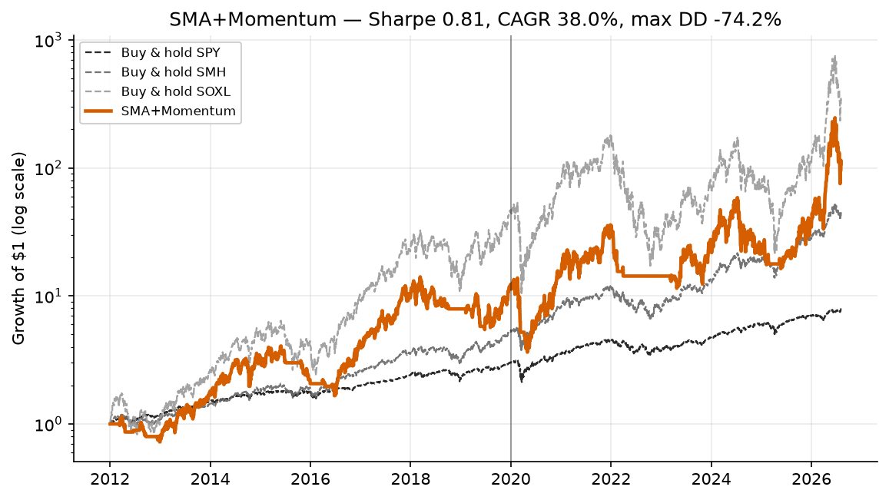

> **A strategy branch of [trading-experiments](../../tree/main).** This page is the complete
> write-up for one strategy. The shared backtest harness, setup instructions, the head-to-head
> benchmark across every strategy, and the execution notes all live on
> [`main`](../../tree/main) — this branch has that same code and those same results, it just
> leads with the strategy instead.
>
> Other strategies: [Donchian + Aroon](../../tree/strategy/donchian-aroon) &middot; [Seykota](../../tree/strategy/seykota) &middot; [EMA9 / RSI14](../../tree/strategy/ema-rsi-meanrev) &middot; [Sentiment (design)](../../tree/strategy/sentiment)
# Strategy 2 — 200-day SMA + 12-month absolute momentum

The classic dual-filter trend model: stay long while price is above its long moving average
**and** the trailing year of return is positive; sit in cash otherwise.

This branch documents the **incumbent that got beaten**. It was the live strategy for a real
aggressive-account sleeve until August 2026, when a Donchian channel breakout replaced it. It is
kept here in full because "the thing we replaced" is the most important benchmark in any research
repo — a new strategy that cannot beat the old one on identical bars has not been demonstrated to
do anything.

Implementation: [`strategies/sma_momentum.py`](strategies/sma_momentum.py).

---

## The strategy

| | |
|---|---|
| Signal instrument | SMH (VanEck Semiconductor ETF) |
| Traded instrument | SOXL (Direxion Daily Semiconductor Bull 3×) |
| Bar timeframe | 1 day |
| Entry / hold condition | `close > SMA(200)` **AND** `12-month return > 0` |
| Position | 100% SOXL when the condition holds, 100% cash otherwise |
| Parameters | `sma_len=200`, `mom_len=252` |

The trend is read from SMH and expressed in SOXL. SMH is the clean, unleveraged proxy for the
semiconductor sector; SOXL is the same sector at 3× daily leverage. Reading the trend off SOXL
directly is worse — its own price is noisier and decays in chop, so the moving average it produces
is a less reliable description of what the sector is doing.

### Lineage

Two well-documented ideas stacked on top of each other:

- **Moving-average timing** — the Faber-style rule of holding a risk asset only while it trades
  above its long-horizon moving average (commonly the 200-day or 10-month line). The mechanism is
  crash avoidance: large drawdowns are persistent enough that a lagging filter still exits before
  most of the damage.
- **Absolute (time-series) momentum** — the Moskowitz–Ooi–Pedersen style filter requiring the
  trailing 12-month return to be positive. Unlike cross-sectional momentum it compares an asset
  only against its own past, so it works on a single instrument.

Requiring **both** is deliberately conservative. The two filters disagree most often at turning
points, and the `AND` means the strategy waits for confirmation before re-entering. That reduces
some false starts, at the cost of entering later.

---

## The math

Let `P_t` be the adjusted close of the signal instrument on day `t`.

**Simple moving average** over `n = 200` days:

```
SMA_t(n) = (1/n) · Σ_{i=0}^{n-1} P_{t−i}
```

**Absolute momentum** over `m = 252` trading days (≈ 12 months):

```
MOM_t(m) = P_t / P_{t−m} − 1
```

**Signal:**

```
uptrend_t = 1[ P_t > SMA_t(200) ]  ∧  1[ MOM_t(252) > 0 ]
```

**Position carried into the next day:**

```
w_{t+1} = uptrend_t        ∈ {0, 1}
```

### No-look-ahead convention

Every strategy in this repo obeys the same rule, implemented once in
[`common/engine.py`](common/engine.py): the signal is computed from data **up to and including
today's close**, and the resulting position earns **tomorrow's** return. The simulation loop books
today's return on the position it was *already* holding, and only then decides what to carry into
tomorrow. Costs of 5 bps per side are charged on the day the position changes.

### The structural property that matters: this signal is stateless

Note what `w_{t+1} = uptrend_t` says. The next position is a function of **today's market state
alone**. It does not depend on the current position:

```
stateless (this strategy):   w_{t+1} = f(market_t)
stateful  (breakout model):  w_{t+1} = g(market_t, w_t)
```

That single difference drives most of the behavioural gap between this strategy and the Donchian
breakout on the sibling branch. Because the position is a pure function of a **threshold crossing**,
the strategy is obliged to trade every time `P_t` oscillates across `SMA_t(200)`. It has no memory
with which to say "I am already long, and nothing decisive has happened, so I will do nothing."

Formally: the set of invested days is `{t : uptrend_t = 1}`, and the number of round trips is the
number of connected components of that set. Every excursion of price back across the moving
average — however brief, however small — splits a component and manufactures a round trip. This is
the textbook whipsaw failure mode, and it is not a tuning problem; it is structural to a stateless
threshold rule.

The measured consequence is **4.0 round trips per year** against **0.9** for the stateful breakout
model, on identical bars.

---

## Expected results


Growth of $1 on a log scale, so equal vertical distances are equal percentage moves. Benchmarks are dashed and grey; the out-of-sample period begins at the vertical line.



All figures below come from `python run_benchmark.py`, over **2012-01-03 → 2026-08-05**
(3,668 trading days), net of **5 bps per side**, with Sharpe computed at a **0% risk-free rate**.
In-sample is before 2020-01-01; out-of-sample is 2020-01-01 onward.

### Headline

| Metric | Value |
|---|---|
| Sharpe (full period) | **0.81** |
| Sharpe in-sample (2012–2019) | 0.86 |
| Sharpe out-of-sample (2020–2026) | 0.83 |
| CAGR | 38.0% |
| Annualized volatility | 71.7% |
| Max drawdown | **−74.2%** |
| Growth multiple | 108.1× |
| Time invested | 76% |
| Round trips per year | 4.0 |

### Against the alternatives

| Strategy | Sharpe | CAGR | Max DD | Round trips/yr |
|---|---|---|---|---|
| Donchian+Aroon breakout | **0.90** | 46.6% | −75.7% | 0.9 |
| **SMA+Momentum (this branch)** | 0.81 | 38.0% | −74.2% | 4.0 |
| Seykota (ATR risk-sized) | 0.49 | 5.2% | −16.1% | 6.1 |
| Buy & hold SMH | **1.02** | 29.7% | −45.3% | — |
| Buy & hold SOXL | 0.90 | 49.1% | −90.5% | — |

Two observations worth stating plainly:

- **Neither leveraged strategy beats simply buying and holding SMH on Sharpe** (1.02). The
  leveraged sleeve buys a higher absolute return at a materially worse risk-adjusted return. That
  is a deliberate mandate choice for this account, not a result to be proud of.
- This strategy adds **+8.3 points of CAGR over buy-and-hold SMH** while roughly **doubling** the
  drawdown. Whether that trade is worth making is a risk-tolerance question, not a statistical one.

### Regime consistency

Sharpe within fixed four-year blocks:

| Period | Sharpe |
|---|---|
| 2012–2015 | 0.63 |
| 2016–2019 | 1.05 |
| 2020–2023 | 0.66 |
| 2024–2027 | 1.05 |

The strategy is strongly bimodal: it produces ~1.05 in clean trending stretches and ~0.65 in the
choppier ones. That spread is the whipsaw cost showing up in the results, and it is the single most
useful thing this table tells you.

### A correction worth recording

Earlier project documentation quoted this strategy's Sharpe as **0.89**. That number was a **stale
data vintage** — it was measured on a shorter history and never re-run. Measured on data through
2026-08-05, the same strategy with the same parameters scores **0.80–0.81**.

Nothing was wrong with the original computation. The number simply aged, and it was being cited
long after the window it described had passed. The lesson generalizes to any research repo: a
headline metric copied into a README is a **cached value with no invalidation policy**. Re-run the
backtest before comparing against it. In this repo every published number is regenerated by
`run_benchmark.py --write` into [`results/benchmark.md`](results/benchmark.md), specifically so
that no figure survives on reputation.

---

## Recommended setup

```python
from common import load_pair
from strategies import sma_momentum

signal, traded = load_pair("SMH", "SOXL")
result = sma_momentum.run(signal, traded, sma_len=200, mom_len=252)
```

### Why 200 and 252

Both are conventional rather than optimized, and that is a feature.

- **`sma_len=200`** — the 200-day line is the most widely watched long-horizon moving average in
  equities. Its robustness comes precisely from being a round, unfitted number: results are broadly
  similar anywhere in the 150–250 range, so the choice is not load-bearing.
- **`mom_len=252`** — 252 trading days is one calendar year, the horizon at which time-series
  momentum is most extensively documented.

Neither was swept to find a peak on this data. A parameter chosen from the literature rather than
from the sample it is tested on cannot be overfitted to that sample, which makes the resulting
out-of-sample number (0.83) more trustworthy than a tuned one would be.

### Where this strategy is still the right choice

- **Simplicity.** Two filters, two parameters, no state. It can be implemented correctly in a few
  lines and verified by inspection — a real advantage for anything trading live money.
- **Literature support.** Both components are independently documented across decades and asset
  classes. You are not relying on a single backtest.
- **Unleveraged use.** Most of the case against it below is specific to a 3× ETF in a small cash
  account. Applied to an unleveraged index sleeve, the whipsaw cost is far less punishing and the
  crash-avoidance benefit is unchanged.
- **Long-only accounts that can hold through settlement.** In a margin account, or any account
  large enough that settlement timing is not a constraint, 4 round trips a year is unremarkable.

### Where it loses

- **Turnover against a cash account.** The direct cost of 4.0 round trips/yr is about **0.4%/yr**
  (8 legs × 5 bps); the breakout model's 0.9 round trips/yr costs about **0.09%/yr**. Against a 38%
  CAGR that ~0.3%/yr difference is close to noise, and it would be dishonest to present raw cost as
  the reason to switch.

  The real problem is **operational**. In a cash account, proceeds settle T+1, and re-using unsettled
  proceeds triggers a Good-Faith Violation; enough of them and the account gets restricted. A
  strategy that round-trips 4× a year in unpredictable bursts sits far closer to that constraint
  than one that trades ~once a year. The cost of a GFV is not measured in basis points.
- **Whipsaw on a leveraged instrument.** Each false exit-and-re-entry pays the spread twice *and*
  gives up the recovery leg. On a 3× instrument those recovery legs are large.

Regenerating the charts, and checking the docs render correctly:

```bash
python make_charts.py               # rebuild results/charts/*.png
python tests/test_no_lookahead.py   # prove no strategy can see the future
python tests/check_markdown.py      # tables balanced, links resolve, mermaid parses
```

---

## The research: why it was replaced

The replacement decision came from a head-to-head on identical bars, identical costs, and an
identical no-look-ahead convention — the comparison `run_benchmark.py` performs.

| | In-sample Sharpe | Out-of-sample Sharpe | Round trips/yr |
|---|---|---|---|
| SMA+Momentum | 0.86 | 0.83 | 4.0 |
| Donchian+Aroon | 0.86 | **0.97** | **0.9** |

The two models are **exactly tied in-sample at 0.86**. The entire measured difference appears
out-of-sample, where the breakout holds 0.97 against this strategy's 0.83, while trading about
**4.4× less**.

It is also the weakest of the two trend models in the difficult regimes. In the two choppy
four-year blocks it scores **0.63** and **0.66**, against **0.71** and **0.88** for the breakout.
The strategies are close when trends are clean and diverge when they are not — consistent with the
stateless/stateful distinction above being the actual mechanism rather than a post-hoc story.

### What the evidence does *not* support

The headline Sharpe gap — 0.81 versus 0.90 — is **not** by itself a sound basis for switching, and
it should not be quoted as one. The breakout's 0.90 sits at the favourable corner of its own
parameter neighbourhood; the **median** Sharpe across nearby breakout parameter sets is **0.83**.
Against that median, this strategy's 0.81 is essentially indistinguishable. Anyone selecting on
headline Sharpe alone is selecting on parameter-selection noise.

The defensible case for the replacement rests on two things that are *not* noise:

1. **Out-of-sample consistency** — 0.97 vs 0.83 on data neither model was tuned on, plus a higher
   floor across every sub-period.
2. **Turnover** — 0.9 vs 4.0 round trips per year, which is a structural consequence of stateful
   versus stateless position logic, reproduces across the entire parameter grid, and directly
   reduces Good-Faith-Violation exposure in the account that actually trades it.

Stated precisely: **this strategy was replaced for its trading behaviour and its out-of-sample
robustness, not for its Sharpe ratio.**

---

## Limitations and risks

- **Whipsaw in range-bound regimes.** The dominant failure mode, and structural rather than
  fixable by tuning — see the math section. It is what the 0.63 and 0.66 sub-period Sharpes are
  made of.
- **The exit is lagging, and −74.2% still happened.** A 200-day moving average is slow by
  construction. It cannot outrun a fast decline, and on a 3× instrument a gap-down is realized in
  full before any daily-bar rule can react. The crash filter meaningfully reduces the drawdown
  versus buy-and-hold SOXL (−74.2% vs −90.5%) but does not make the strategy safe. **A −74%
  drawdown is the documented, expected behaviour of this strategy, not a malfunction.**
- **Leveraged-ETF decay.** SOXL resets its 3× exposure daily, so in choppy tape it compounds
  below 3× the index return. The trend filter avoids some of the worst chop but does not eliminate
  decay. Do not extrapolate leveraged results from unleveraged ones.
- **Regime dependence.** The test window covers the strongest semiconductor bull market on record.
  A single sector over a single favourable regime is one observation, not a sample. The 76% time-
  invested figure means most of the measured return comes from being long during that bull; a flat
  or bearish semiconductor decade would produce long stretches of 0% cash return.
- **Daily-close fills.** The simulation signals and fills on the daily close. Real execution
  incurs slippage against that mark, and an intraday implementation would fill at different prices.
  The 5 bps/side cost is an estimate of this, not a measurement.
- **Two filters, one sample.** Requiring both `AND` conditions was not validated against the
  single-filter alternatives in this repo. It is inherited from the literature, and its incremental
  contribution here is unmeasured.
- **Sharpe is a poor summary for this return distribution.** The returns are fat-tailed and skewed
  at 71.7% annualized volatility. Sharpe is reported because it was the stated selection criterion,
  not because it adequately describes the risk.

---

## Reproducing these numbers

```bash
pip install -r requirements.txt
python run_benchmark.py                 # print the comparison tables
python run_benchmark.py --write         # regenerate results/benchmark.md
```

Every figure in this document is produced by that command. If a number here disagrees with
[`results/benchmark.md`](results/benchmark.md), the generated file is correct and this document is
stale — the failure mode described in the correction above.

---

## Glossary

Abbreviations used on this page. The repo-wide list, covering every term used anywhere in this project, is in [`GLOSSARY.md`](GLOSSARY.md) — it is available on every branch.

| Term | Definition |
|---|---|
| **Sharpe ratio** | Return per unit of volatility (annualised mean daily return / annualised standard deviation), at a 0% risk-free rate. ~1.0 is respectable. |
| **CAGR** | Compound Annual Growth Rate - the average yearly compounded return. |
| **Max DD (drawdown)** | Worst peak-to-trough decline. -75% means the account fell to a quarter of its previous high. |
| **IS / OOS** | In-sample (2012-2019, used for tuning) vs out-of-sample (2020-2026, held back). A large drop from IS to OOS indicates overfitting. |
| **Vol** | Annualised standard deviation of daily returns - how much the value bounces around. |
| **bps** | Basis points - hundredths of a percent. 5 bps = 0.05%. |
| **Exposure** | Share of days actually holding a position rather than sitting in cash. |
| **Round trip** | One complete buy-then-sell cycle, i.e. two trades. |
| **SMH / SOXL / SPY** | VanEck Semiconductor ETF (the signal instrument) / Direxion Daily Semiconductor Bull 3x (the traded instrument) / SPDR S&P 500 ETF (the broad-market benchmark). |
| **B&H** | Buy and hold - the do-nothing benchmark. |
| **SMA** | Simple Moving Average - the plain average of the last n closes. SMA(200) is a common dividing line between uptrend and downtrend. |
| **Absolute momentum** | Comparing an instrument to its own past, e.g. is the 12-month return positive. Distinct from ranking instruments against each other. |
| **Stateless signal** | A signal that depends only on today's market, so it flips every time price crosses the threshold. The source of whipsaw. |
| **Whipsaw** | Repeatedly being stopped out and re-entering in choppy price action, paying costs each time. |
| **Regime filter** | A rule deciding whether to be in the market at all. |
