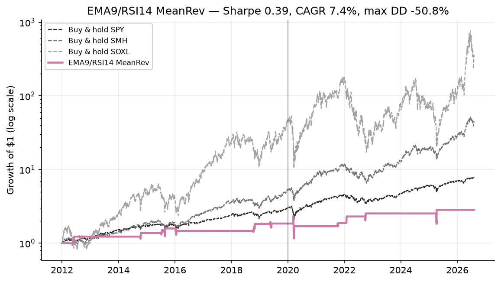

> **A strategy branch of [trading-experiments](../../tree/main).** This page is the complete
> write-up for one strategy. The shared backtest harness, setup instructions, the head-to-head
> benchmark across every strategy, and the execution notes all live on
> [`main`](../../tree/main) — this branch has that same code and those same results, it just
> leads with the strategy instead.
>
> Other strategies: [Donchian + Aroon](../../tree/strategy/donchian-aroon) &middot; [SMA + Momentum](../../tree/strategy/sma-momentum) &middot; [Seykota](../../tree/strategy/seykota) &middot; [HMM regime](../../tree/strategy/hmm-regime) &middot; [MAG7 overnight](../../tree/strategy/mag7-overnight) &middot; [Sentiment (design)](../../tree/strategy/sentiment)
# Strategy 4 — EMA(9) / RSI(14) mean reversion

Implementation: [`strategies/ema_rsi_meanrev.py`](strategies/ema_rsi_meanrev.py)
Benchmark harness: [`run_benchmark.py`](run_benchmark.py)

> **Read this one carefully.** It has the weakest portfolio numbers in the repo (0.39 Sharpe)
> *and* the most statistically significant per-trade edge (t = 3.60, 87% win rate). Both are
> true, and the reason they are not a contradiction is the most useful thing in this document.

> [!NOTE]
> **The figures on this page are from the benchmark run dated 2026-08-05.** `main` was re-run on
> 2026-09-01 against data through 2026-08-31; the longer window moved the headline numbers
> slightly — this strategy's Sharpe held at **0.39** while its annualised volatility moved 27.6% → 27.5%. The analysis below (the parameter sweep, the
> per-regime breakdown, the trade table) is a self-consistent snapshot of that earlier run and has
> not been regenerated, so it is left intact rather than half-updated. For current figures see
> [`results/benchmark.md`](results/benchmark.md), which is regenerated on every branch along with
> `main`.

---

## 1. The strategy

This is the repository's **first non-trend strategy**, and that is why it is here. The other
three all assume the same thing in different clothing: that price movement persists — a
breakout keeps going, a market above its 200-day average keeps rising, a trend that survived
an ATR stop keeps trending. This one assumes the opposite over a short horizon, namely that a
sharp move *away* from a fast moving average tends to snap back toward it.

| Component | Rule |
|---|---|
| Signal instrument | SMH (VanEck Semiconductor ETF) |
| Traded instrument | SOXL (Direxion Daily Semiconductor Bull 3×) |
| Bar timeframe | 1 day |
| **Entry** | `RSI(14) < 30` **AND** `close < EMA(9)` |
| **Exit** | `close > EMA(9)` |
| Optional exit | `max_hold` bars elapsed (default `0` = off) |
| Position | 100% SOXL while in a trade, 100% cash otherwise |

The signal/traded split follows the repo convention: the trend read comes from the clean,
unleveraged SMH, and is expressed in the 3× instrument. §5 shows this convention costs the
strategy dearly here — mean reversion and daily-reset leverage are a poor pairing.

### Why two conditions

The entry conditions look redundant and are not. They fail in different directions:

- `RSI(14) < 30` says the *recent sequence* of moves was unusually one-sided to the downside.
  It is a statement about momentum and magnitude over the last ~14 bars.
- `close < EMA(9)` says price is *currently* below its short-term anchor. It is a statement
  about right now.

Requiring both filters out the case that ruins naive oversold buying: a market that is still
registering an oversold RSI from a decline that has already begun reversing. In that state RSI
lags below 30 while price has climbed back above its EMA, and buying there means entering
after the reversion has been paid out. Demanding both conditions costs some entries and avoids
that class of late fill.

---

## 2. The math

### Notation

Let $C_t$ be the closing price of the signal instrument (SMH) on day $t$.

### Exponential moving average

$$\text{EMA}_t = \alpha C_t + (1-\alpha)\,\text{EMA}_{t-1},
\qquad \alpha = \frac{2}{\text{span}+1}$$

With `ema_len = 9`, $\alpha = 2/10 = 0.2$. In code this is
`signal.ewm(span=ema_len, adjust=False).mean()`, which implements exactly that recursion
seeded on the first observation.

### Wilder's RSI — and the smoothing that is easy to get wrong

Split each day's change into gain and loss components:

$$\Delta_t = C_t - C_{t-1}, \qquad
G_t = \max(\Delta_t,\,0), \qquad
L_t = \max(-\Delta_t,\,0)$$

Then smooth both. **This is the step that is commonly implemented incorrectly.** Wilder's
smoothing is an exponential average with

$$\alpha = \frac{1}{n} \qquad \text{(equivalently } \text{span} = 2n-1\text{)}$$

not a simple rolling mean over $n$ bars. In code:

```python
avg_gain = gain.ewm(alpha=1.0 / length, adjust=False).mean()
avg_loss = loss.ewm(alpha=1.0 / length, adjust=False).mean()
```

Substituting `rolling(n).mean()` produces a series that tracks the real RSI closely enough to
look correct on a chart while shifting the exact bars on which threshold crossings occur. For
a strategy whose entire entry condition is a threshold crossing, that silently changes which
trades happen. With only 15 trades in the whole sample (§3), changing even two of them moves
every statistic in this document.

Finally:

$$\text{RS}_t = \frac{\overline{G}_t}{\overline{L}_t},
\qquad
\text{RSI}_t = 100 - \frac{100}{1 + \text{RS}_t}$$

### RSI edge cases

Handled explicitly in the code rather than left to produce `inf` or `NaN`:

| Condition | Meaning | RSI |
|---|---|---|
| $\overline{L}_t = 0$, $\overline{G}_t > 0$ | unbroken run of up days | 100 (RS infinite) |
| $\overline{G}_t = 0$, $\overline{L}_t > 0$ | unbroken run of down days | 0 (falls out naturally, RS = 0) |
| $\overline{G}_t = \overline{L}_t = 0$ | perfectly flat series | 50 by convention |

```python
out = out.where(avg_loss > 0, 100.0)                       # no losses -> 100
out = out.where((avg_gain > 0) | (avg_loss > 0), 50.0)     # perfectly flat -> 50
```

### Triggers and state machine

$$\text{Entry}_t = \left(\text{RSI}_t < \theta\right) \wedge \left(C_t < \text{EMA}_t\right)
\qquad
\text{Exit}_t = C_t > \text{EMA}_t$$

with $\theta$ = `rsi_entry`. Like the Donchian strategy this is **stateful** — the two
triggers are independent and neither implies the other:

| Current state | Condition | Next state |
|---|---|---|
| flat | $\text{Entry}_t$ | long |
| flat | otherwise | flat |
| long | $\text{Exit}_t$ (or `max_hold` reached) | flat |
| long | otherwise | long |

Note the entry and exit conditions are **mutually exclusive by construction**: entry requires
$C_t < \text{EMA}_t$ and exit requires $C_t > \text{EMA}_t$. A round trip therefore always
takes at least two bars, and the strategy can never enter and exit on the same close.

The `max_hold` time stop defaults to **off**. That is deliberate: the headline result should
reflect the rules exactly as stated, including their worst property — a position entered into
a sustained decline is held until price recovers above a 9-day EMA, with no other escape.

### Return accounting and the no-look-ahead convention

Identical to every other strategy in the repo, implemented once in `common/engine.py`:
signals are computed from data up to and including today's close, and the resulting position
earns **tomorrow's** return. Each day the loop books today's return on the position it was
already holding, *then* decides what to carry into tomorrow.

$$r^{\text{strat}}_t = s_t \cdot r^{\text{traded}}_t - c \cdot \mathbb{1}\left[s_{t+1} \neq s_t\right]$$

with $c = 5$ bps per side. A 252-day warm-up is discarded so all strategies are scored on
identical bars.

### Metric conventions

- **Sharpe**: annualized arithmetic mean daily return over annualized daily standard
  deviation, at a **0% risk-free rate**.
- **CAGR**: geometric, from the compounded equity curve.
- **Max drawdown**: on daily closes.

The 0% cash assumption matters more here than anywhere else in the repo except Seykota: this
strategy holds cash 97.6% of the time. See §6.

---

## 3. Expected results


Growth of $1 on a log scale, so equal vertical distances are equal percentage moves. Benchmarks are dashed and grey; the out-of-sample period begins at the vertical line.



Backtest period **2012-01-03 → 2026-08-05** (3,668 trading days), signal SMH / traded SOXL,
5 bps per side, Sharpe at 0% risk-free. In-sample before 2020-01-01, out-of-sample after.

### Headline

| Strategy | Sharpe | IS | OOS | CAGR | Vol | MaxDD | Growth | Exposure | Round trips/yr |
|---|---|---|---|---|---|---|---|---|---|
| **EMA9/RSI14 MeanRev** | **0.39** | 0.55 | 0.35 | 7.4% | 27.6% | −50.8% | 2.8× | **2.4%** | 1.0 |
| Donchian+Aroon | 0.90 | — | — | 46.6% | — | −75.7% | — | 79% | 0.9 |
| SMA+Momentum | 0.81 | — | — | 38.0% | — | −74.2% | — | 76% | 4.0 |
| Seykota | 0.49 | — | — | 5.2% | — | −16.1% | — | 12% | 6.1 |
| Buy & hold SMH | 1.02 | — | — | 29.7% | — | −45.3% | — | 100% | — |
| Buy & hold SOXL | 0.90 | — | — | 49.1% | — | −90.5% | — | 100% | — |

On the repo's stated selection criterion it is **last**. Sharpe 0.39 against 0.90 for the
breakout and 1.02 for simply buying the index.

### Regime consistency

| Period | Sharpe |
|---|---|
| 2012–2015 | 0.79 |
| 2016–2019 | 0.32 |
| 2020–2023 | 0.41 |
| 2024–2027 | 0.27 |

A monotone decline from the first block to the last. §6 discusses what can and cannot be
concluded from that with 15 trades.

### The trade record

The strategy took **15 trades in 14.6 years**, average hold **5.9 bars**, and was in the
market on **2.4% of days**:

| # | Entry | Exit | Bars | Return |
|---|---|---|---|---|
| 1 | 2012-05-17 | 2012-05-29 | 7 | +6.28% |
| 2 | 2012-06-01 | 2012-06-06 | 3 | +15.93% |
| 3 | 2014-10-10 | 2014-10-20 | 6 | +12.07% |
| 4 | 2015-07-08 | 2015-07-14 | 4 | +6.61% |
| 5 | 2015-07-22 | 2015-07-29 | 5 | +2.25% |
| 6 | 2015-08-20 | 2015-08-27 | 5 | +6.01% |
| 7 | 2016-01-07 | 2016-01-22 | 10 | −7.25% |
| 8 | 2018-10-10 | 2018-10-16 | 4 | +9.22% |
| 9 | 2018-10-24 | 2018-10-31 | 5 | +14.31% |
| 10 | 2019-05-20 | 2019-06-04 | 10 | +1.13% |
| 11 | 2020-03-12 | 2020-03-24 | 8 | −8.03% |
| 12 | 2021-10-04 | 2021-10-14 | 8 | +10.89% |
| 13 | 2022-01-27 | 2022-01-31 | 2 | +22.61% |
| 14 | 2022-09-23 | 2022-10-04 | 7 | +10.07% |
| 15 | 2025-04-03 | 2025-04-09 | 4 | +11.92% |

| Statistic | Value |
|---|---|
| Trades | 15 |
| Mean return per trade | **+7.60%** |
| Standard deviation | 8.19% |
| **t-statistic** | **3.60** |
| 95% CI on the mean trade | **+3.46% to +11.75%** |
| Win rate | **86.7%** (13 of 15) |
| Median | +9.22% |
| Best / worst | +22.61% / −8.03% |
| Compounded | +187.9% |
| Compounded, excluding the single best trade | +134.8% |

The confidence interval excludes zero comfortably, and dropping the best trade still leaves
+134.8%, so the record is not one lucky outlier propping up fourteen coin flips.

---

## 4. Why a significant edge produces a bad Sharpe

This is the central result and it is worth stating precisely, because it is a general lesson
about evaluating strategies rather than a fact about this one.

The per-trade edge is real and statistically significant. The portfolio Sharpe is 0.39. There
is no contradiction, because **Sharpe measures the equity curve, not the trades**, and this
equity curve is flat on 97.6% of days.

### The arithmetic

Let $f$ be the fraction of days invested, and let in-market daily returns have mean $\mu$ and
standard deviation $\sigma$. Over the full series, including the idle days:

$$\mathbb{E}[r] = f\mu
\qquad
\operatorname{Var}[r] = f\left(\mu^2 + \sigma^2\right) - f^2\mu^2 \;\approx\; f\sigma^2$$

since $\mu^2 \ll \sigma^2$ at daily frequency. So the full-series standard deviation is
approximately $\sigma\sqrt{f}$, and

$$\text{Sharpe}_{\text{full}} \;=\; \frac{f\mu}{\sigma\sqrt{f}}\sqrt{252} \;=\; \sqrt{f}\cdot\text{Sharpe}_{\text{deployed}}$$

**Idle capital scales Sharpe by $\sqrt{f}$.** With $f = 0.024$:

$$\sqrt{0.024} \approx 0.155
\qquad\Longrightarrow\qquad
\text{Sharpe}_{\text{deployed}} \;\approx\; \frac{0.39}{0.155} \;\approx\; 2.5$$

(Approximate — it drops the $\mu^2$ terms and uses the reported exposure — but the order of
magnitude is the point.) The edge *while deployed* is excellent. The strategy simply refuses
to deploy, and a metric computed over calendar time charges it for every day it sits out.

### What this implies about how to use it

The problem is capital efficiency, not signal quality. Three consequences follow:

1. **It is a poor standalone allocation.** Committing an account to this strategy means
   holding cash 97.6% of the time to capture roughly one trade a year.
2. **It is a plausible overlay.** The natural pairing is with capital that is otherwise idle.
   Note the Donchian strategy sits in cash 21% of the time and this one is invested 2.4% of
   the time — those windows overlap heavily, since a breakout system is flat precisely when
   markets are selling off and an oversold-dip system wants to buy.
3. **It wants breadth, not depth.** Running the same rules across many instruments would let
   the rare trades overlap in time, raising $f$ toward something reasonable without weakening
   any individual signal. This is the same conclusion the Seykota branch reaches from the
   opposite direction: both strategies are cash-heavy, and both are diagnosing a **universe
   that is too small**, not a rule that is broken.

The distinction from Seykota is worth keeping straight. Seykota holds cash because its *risk
rule* caps position size on a volatile instrument. This strategy holds cash because its
*entry condition* is rarely satisfied. Same symptom, different cause, same remedy: more
instruments.

---

## 5. The counterweight: closed-trade statistics hide path risk

An 86.7% win rate and a worst closed trade of −8.03% describe a comfortable strategy. The
equity curve does not agree. **Maximum drawdown was −50.8%**, and all of it happened inside
**one trade**.

Trade 11 opened 2020-03-12, into the COVID crash. Daily strategy returns while it was open:

| Date | Return | Cumulative in-trade |
|---|---|---|
| 2020-03-12 | −0.05% | −0.0% |
| 2020-03-13 | **+27.32%** | +27.3% |
| 2020-03-16 | **−38.59%** | −21.9% |
| 2020-03-17 | +9.94% | −14.1% |
| 2020-03-18 | **−25.89%** | −36.3% |
| 2020-03-19 | +7.58% | −31.5% |
| 2020-03-20 | −8.55% | −37.4% |
| 2020-03-23 | +9.30% | −31.5% |
| 2020-03-24 | **+34.21%** | −8.1% |

The position ran from **+27.3% to −37.4%** before closing at −8.1%. Portfolio equity peaked
2020-03-13 and troughed 2020-03-20 — a −50.8% hole that the trade table records as a −8.03%
loss.

The lesson generalizes well beyond this strategy: **a trade log is a summary of endpoints, and
endpoints are not the risk.** Anyone sizing a position from the statistics in §3 — 87% win
rate, worst loss 8% — would have been badly misled about what holding this strategy actually
felt like, and about how much capital it could destroy if the exit had not eventually
triggered. Mean reversion systems are especially prone to this, because their exit rule is
"wait for recovery", which converts path risk into duration risk and hides it from the
closed-trade record.

It is also the clearest illustration in the repo of why the strategy should not be run on a
3× instrument. See the unleveraged comparison in §6.

---

## 6. The research

### Sensitivity is noise, not structure

`rsi_entry` swept, everything else at defaults, traded on SOXL:

| `rsi_entry` | Sharpe | IS | OOS | CAGR | MaxDD | Exposure | Trips/yr |
|---|---|---|---|---|---|---|---|
| 20 | — | — | — | — | — | **0.0%** | 0.0 |
| 25 | 0.53 | 0.88 | 0.35 | 8.1% | −10.7% | 0.8% | 0.5 |
| **30** | **0.39** | 0.55 | 0.35 | 7.4% | −50.8% | 2.4% | 1.0 |
| 35 | 0.53 | 0.13 | 0.83 | 14.0% | −67.3% | 6.1% | 2.7 |
| 40 | 0.46 | 0.47 | 0.49 | 11.1% | −67.7% | 13.5% | 5.6 |
| 45 | 0.52 | 0.61 | 0.50 | 14.4% | −72.1% | 20.7% | 10.1 |

Two things to notice.

**RSI(14) below 20 never occurred.** In 14.6 years SMH did not close with a 14-day RSI under
20 even once, so that configuration takes zero trades. Worth knowing before selecting a
threshold from a textbook.

**There is no ridge.** Sharpe bounces between 0.39 and 0.53 with no discernible structure, and
the in-sample/out-of-sample split flips violently — 0.88 → 0.35 at `rsi_entry = 25`, and
0.13 → 0.83 at `rsi_entry = 35`. Compare directly with the Donchian `exit_len` sweep on the
sibling branch, where median Sharpe rose **monotonically** 0.475 → 0.805 and then flattened
into a broad plateau. That smooth ridge is what a real structural effect looks like. This
scatter is what its absence looks like. Any parameter chosen from this table is chosen from
noise, and the fact that 30 is not even the best value in the column should be read as
evidence about the table rather than as an argument for changing the default.

### The time stop

| `max_hold` | Sharpe |
|---|---|
| 0 (off) | 0.39 |
| 3 | 0.02 |
| 5 | 0.22 |
| 10 | 0.39 |
| 20 | 0.39 |

A 3-bar stop destroys the strategy — it forces exits before reversion has completed, which is
the one thing the rules exist to wait for. Anything ≥ 10 is identical to off, because the
average hold is 5.9 bars and the longest trade ran 10. The time stop is either harmful or
inert; there is no setting at which it helps.

### The EMA length is not load-bearing

| `ema_len` | Sharpe | CAGR | Exposure |
|---|---|---|---|
| 5 | 0.32 | 5.2% | 2.0% |
| **9** | **0.39** | 7.4% | 2.4% |
| 20 | 0.38 | 7.2% | 3.6% |
| 50 | 0.36 | 6.8% | 6.8% |

Nearly flat from 9 to 50. **RSI does the work**; the EMA mostly modulates how often the
entry condition can be satisfied. The "EMA(9)" in the strategy's name is the least important
number in it.

### Leverage is the wrong vehicle for this strategy

Same rules, same signal, but trading **SMH** (unleveraged) instead of SOXL:

| Traded instrument | Sharpe | IS | OOS | CAGR | MaxDD | Exposure |
|---|---|---|---|---|---|---|
| SOXL (3×) | 0.39 | 0.55 | 0.35 | 7.4% | **−50.8%** | 2.4% |
| SMH (1×) | **0.43** | 0.57 | 0.41 | 3.6% | **−15.2%** | 2.4% |

Better Sharpe **and** a drawdown less than a third as deep, for identical trades and identical
timing. The 3× version buys 2× the CAGR at 3.3× the drawdown.

The mechanism is specific and worth stating: this strategy deliberately enters during the
highest-volatility conditions available — that is what an RSI below 30 *means*. Daily-reset
leveraged ETFs suffer their worst decay in exactly those conditions, because volatility drag
scales with the square of daily moves. A trend follower holds 3× exposure through calm
uptrends, where decay is mild. A mean-reversion strategy holds it through panics, where decay
is severe. The two strategies are not merely different; they select opposite volatility
regimes, and leverage rewards one and punishes the other.

If this strategy is worth running at all, it is worth running unleveraged.

---

## 7. Limitations and risks

**The sample is 15 trades.** Every statistic in §3 rests on them. This is the dominant
limitation and it is not fixable by better analysis — only by more data, more instruments, or
a longer history.

**The t-statistic assumes independent trades, and they are visibly not.** They cluster: two in
2012, three in 2015, two in 2018 (the two October 2018 trades are eight days apart), and two
in 2022. Clustered trades share market conditions, so the effective sample size is smaller
than 15 and **t = 3.60 overstates the significance**. The honest reading is "suggestive with a
small, correlated sample", not "established".

**Buying dips works by construction in a secular bull market.** The test window is the
strongest semiconductor bull market on record. A strategy that systematically buys declines
and waits for recovery is guaranteed to look good when every decline recovered. This sample
contains almost no evidence about behaviour in a market that declines and *stays* down — which
is precisely the environment in which "hold until price exceeds its 9-day EMA" becomes an
unbounded commitment.

**The declining sub-period Sharpe (0.79 → 0.32 → 0.41 → 0.27) cannot be interpreted.** It is
equally consistent with a decaying edge, with regime luck, and with random variation across
blocks containing three or four trades each. Fifteen trades cannot distinguish these. Do not
read it as evidence of decay; do not read its absence as evidence of stability.

**No intraday stop.** §5 showed a −37% intra-trade excursion. The backtest evaluates only
daily closes, so nothing intervenes inside a collapsing position. A live implementation would
face the same exposure with the added risk of gapping through any stop that was added.

**Daily-close fills.** Signals and fills both occur at the close. Real execution near the close
gets a different price; the 5 bps/side model is an estimate of that, not a measurement. On the
March 2020 bars, when SOXL moved 25–38% in a day, slippage would have been far worse than 5 bps.

**Single instrument, single sector.** No diversification, and — as §4 argues — this is the
strategy in the repo that most needs it.

**Cash earns 0%.** At 97.6% idle, a realistic cash yield would improve the result more than for
any other strategy here. It would not change the ranking against a 46.6% CAGR alternative, but
a comparison decided by a few points of CAGR should re-run with `rf_annual` set.

---

## Reproducing these numbers

```bash
pip install -r requirements.txt
python run_benchmark.py                 # all strategies, identical bars
python run_benchmark.py --write         # regenerate results/benchmark.md
```

The headline and sub-period tables are generated by that command. The trade-level table, the
sensitivity sweeps and the March 2020 daily breakdown come from ad-hoc analysis over the same
`strategies.ema_rsi_meanrev.run()` function — reproduce them by calling `run()` with the
parameter overrides shown, for example:

```python
from common import load_pair, perf_stats
from strategies import ema_rsi_meanrev as mr

signal, traded = load_pair("SMH", "SOXL")
print(perf_stats(mr.run(signal, traded, rsi_entry=25.0).daily_ret))   # threshold sweep
print(perf_stats(mr.run(signal, signal).daily_ret))                   # unleveraged variant
```

If a number here disagrees with [`results/benchmark.md`](results/benchmark.md), the generated
file is correct and this document is stale.

---

## Glossary

Abbreviations used on this page. The repo-wide list, covering every term used anywhere in this project, is in [`GLOSSARY.md`](GLOSSARY.md) — it is available on every branch.

| Term | Definition |
|---|---|
| **Sharpe ratio** | Return per unit of volatility (annualised mean daily return / annualised standard deviation), at a 0% risk-free rate. ~1.0 is respectable. |
| **CAGR** | Compound Annual Growth Rate - the average yearly compounded return. |
| **Max DD (drawdown)** | Worst peak-to-trough decline. -75% means the account fell to a quarter of its previous high. |
| **IS / OOS** | In-sample (2012-2019, used for tuning) vs out-of-sample (2020-2026, held back). A large drop from IS to OOS indicates overfitting. |
| **Vol** | Annualised standard deviation of daily returns - how much the value bounces around. |
| **bps** | Basis points - hundredths of a percent. 5 bps = 0.05%. |
| **Exposure** | Share of days actually holding a position rather than sitting in cash. |
| **Round trip** | One complete buy-then-sell cycle, i.e. two trades. |
| **SMH / SOXL / SPY** | VanEck Semiconductor ETF (the signal instrument) / Direxion Daily Semiconductor Bull 3x (the traded instrument) / SPDR S&P 500 ETF (the broad-market benchmark). |
| **B&H** | Buy and hold - the do-nothing benchmark. |
| **EMA** | Exponential Moving Average - a moving average weighting recent prices more heavily. |
| **RSI** | Relative Strength Index - a 0-100 oscillator measuring how one-sided recent moves have been. Below 30 is conventionally oversold. |
| **Wilder smoothing** | The exponential average with alpha = 1/n used inside a correct RSI. Not a simple rolling mean - the difference shifts threshold crossings. |
| **Mean reversion** | Betting a price move will reverse. Buys weakness. The opposite assumption to trend following. |
| **t-statistic** | How many standard errors an average sits from zero. An absolute value above ~2 is conventionally 'unlikely to be chance'. |
| **CI (confidence interval)** | A range that plausibly contains the true value. One excluding zero is evidence an effect is real. |
| **Path risk** | Losses experienced *during* a trade that a closed-trade record never shows. |
