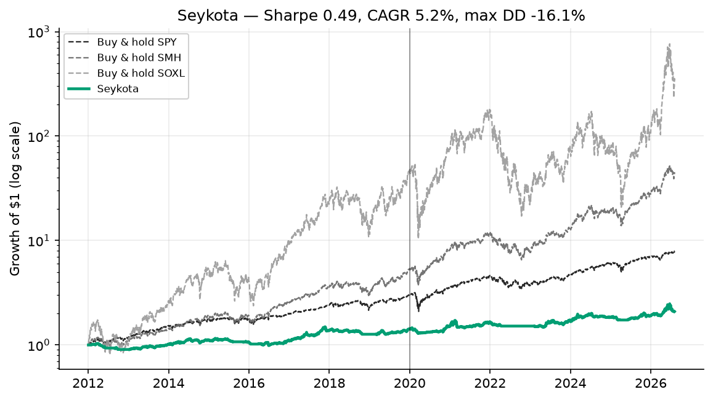

> **A strategy branch of [trading-experiments](../../tree/main).** This page is the complete
> write-up for one strategy. The shared backtest harness, setup instructions, the head-to-head
> benchmark across every strategy, and the execution notes all live on
> [`main`](../../tree/main) — this branch has that same code and those same results, it just
> leads with the strategy instead.
>
> Other strategies: [Donchian + Aroon](../../tree/strategy/donchian-aroon) &middot; [SMA + Momentum](../../tree/strategy/sma-momentum) &middot; [EMA9 / RSI14](../../tree/strategy/ema-rsi-meanrev) &middot; [Sentiment (design)](../../tree/strategy/sentiment)
# Strategy 3 — Seykota-style ATR risk-sized trend following

> **Verdict for this account: rejected — twice.** Not because the method is weak, but
> because it is the wrong tool for the job. Applied to a single 3× leveraged ETF it does
> exactly what it is designed to do (cap risk at 2% of equity per trade) and the honest
> consequence is that ~88% of the account sits in cash, producing a genuinely excellent
> −16.1% max drawdown alongside a 5.2% CAGR that does not clear this account's return bar.
> Seykota's method is built for a **diversified multi-market book**. With n=1 instrument
> there is no diversification to aggregate, so the risk budget is all drag and no benefit.

Implementation: [`strategies/seykota.py`](strategies/seykota.py).

---

## 1. The strategy

Ed Seykota is one of the pioneers of systematic, computerised trend following. He appears
in Jack Schwager's *Market Wizards* (1989), and in the 1970s built one of the first
commercial computerised trading systems for a brokerage — at a time when that meant running
signals on punch cards. His public writing and interviews consistently emphasise risk
management, cutting losses quickly, letting winning trends run, position sizing as a
first-class decision rather than an afterthought, and the psychology of following a system.
This document does not attempt to reconstruct his actual track record or attribute specific
rules to him; what follows is a faithful implementation of the *style* of system he is
associated with, applied to this repo's instrument pair.

The rules as implemented here:

| Component | Rule |
|---|---|
| **Trend** | 50-day EMA > 200-day EMA on the signal instrument (SMH) |
| **Entry** | When flat and the trend is up, buy the traded instrument (SOXL) |
| **Sizing** | Position fraction `f` such that a full stop-out loses exactly 2% of equity |
| **Stop distance** | `atr_mult × ATR%` = 4.0 × the 14-day volatility proxy |
| **Exit** | ATR trailing stop from the high-water close, **or** the trend turning down |
| **Between trades** | Cash |

Two features distinguish this from the other two strategies in this repo:

1. **It is not all-in.** Strategies 1 and 2 are binary — fully invested or fully in cash.
   Here, position size falls out of the risk budget. The more volatile the instrument, the
   smaller the position. This is the entire point of the comparison.
2. **It rides a trailing stop, not a channel.** The exit tightens and loosens with realised
   volatility rather than sitting at a fixed lookback low.

**No-look-ahead convention** (shared across this repo): signals are computed from data up
to and including today's close, and the resulting position earns **tomorrow's** return.
Concretely, the loop marks the open position to market on today's move *first*, then acts
at today's close. Costs are 5 bps per side, charged on the actual notional traded.

---

## 2. The math

### Exponential moving averages

Both EMAs use the standard recursion, seeded with the first observation:

```
EMA_t = α · P_t + (1 − α) · EMA_{t−1},        α = 2 / (span + 1)
```

| Leg | Span | α |
|---|---|---|
| Fast | 50 | 2/51 ≈ 0.0392 |
| Slow | 200 | 2/201 ≈ 0.00995 |

`trend_up_t = EMA_fast,t > EMA_slow,t`. This is `pandas.Series.ewm(span=N, adjust=False)`,
which implements exactly the recursion above.

### The ATR proxy

True ATR is built from the high–low–close range. This harness works on **split- and
dividend-adjusted closes**, where a true OHLC range is itself only an approximation (the
adjustment factors are applied to closes; reconstructing consistent adjusted highs and lows
introduces its own error). Daily-return standard deviation is a faithful stand-in for the
purpose at hand, which is *scaling a stop to how much this instrument typically moves*:

```
r_t     = P_t / P_{t−1} − 1
ATR%_t  = stdev( r_{t−13} … r_t )          # 14-day sample standard deviation
```

`ATR%` is expressed as a **fraction of price**, which is what makes the sizing formula
dimensionless and instrument-agnostic.

### Stop distance

```
S_t = atr_mult × ATR%_t        (floored at 1e-6 to avoid division by zero)
```

With `atr_mult = 4.0`, the stop sits four typical daily moves away from the entry (or from
the high-water mark, once trailing).

### Position sizing — the crux

```
f_t = min( risk_per_trade / S_t ,  max_deploy )
```

The logic: deploy notional `f · E` on equity `E`. If the trade then loses exactly one stop
distance `S`, the dollar loss is

```
f · S · E  =  (risk_per_trade / S) · S · E  =  risk_per_trade · E
```

— i.e. **exactly 2% of equity, regardless of the instrument.** That identity is the whole
idea. Volatile instruments get small positions; quiet instruments get large ones; the
downside per trade is constant.

### Why this collapses on a 3× ETF

`f` is inversely proportional to volatility, and SOXL is extraordinarily volatile. Buy-and-hold
SOXL ran 91.8% annualised volatility over the test window, which is a daily σ of
`0.918 / √252 ≈ 5.8%`. Working the formula through:

| Instrument | Daily σ (ATR% proxy) | Stop distance `S = 4σ` | `f = 2% / S` | Cash |
|---|---|---|---|---|
| **SOXL** (3× semis) | ~5.8% | ~23.1% | **~8.7%** | ~91% |
| SMH (1× semis) | ~1.9% | ~7.5% | ~26.6% | ~73% |
| A quiet instrument | 0.5% | 2.0% | 100% (capped) | 0% |

For `f` to reach the 100% cap you need `4 × ATR% ≤ 2%`, i.e. a daily σ of 0.5% or less.
SOXL's ~5.8% is roughly **11× too volatile** for this risk budget to permit a full position.

The measured average deployment over the full test was **12%** — slightly above the ~8.7%
single-point estimate above, because deployment is averaged across calmer stretches (where
`f` is larger) and because an open position drifts up with price without being re-sized.

**This is not a bug and not a tuning failure. It is the risk rule working correctly.**

---

## 3. Expected results


Growth of $1 on a log scale, so equal vertical distances are equal percentage moves. Benchmarks are dashed and grey; the out-of-sample period begins at the vertical line.



Test window 2012-01-03 → 2026-08-05 (3,668 trading days). Costs 5 bps/side. Sharpe computed
at a 0% risk-free rate. In-sample is everything before 2020-01-01; out-of-sample is
2020-01-01 onward.

| Strategy | Sharpe | IS | OOS | CAGR | Vol | MaxDD | Growth | Avg exposure | Round trips/yr |
|---|---|---|---|---|---|---|---|---|---|
| **Seykota** | **0.49** | 0.52 | 0.49 | **5.2%** | 11.7% | **−16.1%** | 2.1x | **12%** | 6.1 |
| Donchian+Aroon | 0.90 | — | — | 46.6% | — | −75.7% | — | — | — |
| SMA+Momentum | 0.81 | — | — | 38.0% | — | −74.2% | — | — | — |
| Buy & hold SMH | 1.02 | — | — | 29.7% | — | −45.3% | — | — | — |
| Buy & hold SOXL | 0.90 | — | — | 49.1% | — | −90.5% | — | — | — |

### Sub-period Sharpe

| Strategy | 2012–2015 | 2016–2019 | 2020–2023 | 2024–2027 |
|---|---|---|---|---|
| Seykota | 0.23 | 0.76 | 0.46 | 0.53 |

Consistency is respectable — no period is catastrophic, and IS (0.52) and OOS (0.49) agree
closely, which is more than can be said for many fitted systems. The problem is not
instability. The problem is the level.

### Two ratios worth stating explicitly

Both are simple arithmetic on the table above, and they point in *opposite* directions —
which is precisely why a single summary statistic is not sufficient here.

| Strategy | Sharpe per point of drawdown | CAGR / MaxDD (MAR-like) |
|---|---|---|
| **Seykota** | **0.030** (best) | **0.32** (worst) |
| Donchian+Aroon | 0.012 | 0.62 |
| SMA+Momentum | 0.011 | 0.51 |
| Buy & hold SMH | 0.023 | 0.66 |
| Buy & hold SOXL | 0.010 | 0.54 |

Read together: Seykota buys its risk reduction very efficiently in *Sharpe* terms, and very
inefficiently in *return* terms. If you care about not losing money, it is the best system
in this repo by a wide margin. If you care about compounding an aggressive account, it is
the worst.

---

## 4. Recommended setup

### Parameters as tested

| Parameter | Value | Meaning |
|---|---|---|
| `ema_fast` | 50 | Fast EMA leg |
| `ema_slow` | 200 | Slow EMA leg |
| `risk_per_trade` | 0.02 | Fraction of equity risked per trade |
| `atr_len` | 14 | Volatility lookback (days) |
| `atr_mult` | 4.0 | Stop distance in ATR multiples |
| `max_deploy` | 1.0 | Cap on position fraction (no leverage) |

### Where this strategy actually belongs

This is the important part, and it is not a parameter question.

The 2% risk rule is designed for a **diversified portfolio of many, largely uncorrelated
markets** — the classic managed-futures book spanning commodities, FX, rates, and equity
indices. In that setting the arithmetic works out completely differently:

- Each individual position is small (2% risk), exactly as here.
- But you hold **many** of them simultaneously, across markets that do not move together.
- Total portfolio exposure aggregates to something substantial, while total portfolio
  *risk* stays controlled because the positions diversify each other.
- The trends you catch are independent draws, so a losing streak in one sector is offset by
  a trend elsewhere. Over many markets, positive expectancy compounds reliably.

With **n = 1 instrument**, every one of those benefits disappears:

- There is nothing to aggregate — one 8.7% position is the entire book.
- There is no diversification, so the risk budget buys nothing that a smaller all-in
  position would not also buy.
- Idle cash earns nothing in this backtest (0% risk-free assumption), so the ~88% sitting
  in cash is pure opportunity cost.

**Honest recommendation:** if you want to trade this method, trade it the way it was built —
across a broad multi-market universe of 20+ liquid, low-correlation instruments, sized by
the same 2% rule. Expect modest per-market contribution and a portfolio result that is far
better than what a single sleeve can produce. Do **not** use it on one leveraged ETF and
conclude the method is weak; that conclusion would be an artefact of the universe, not the
system.

Conversely, if you are committed to a single-instrument aggressive sleeve, use a binary
all-in strategy (see the `strategy/donchian-aroon` branch) and manage risk through the
**exit**, not through position sizing.

---

## 5. The research

### Evaluated and rejected twice

| Date | Outcome |
|---|---|
| 2026-06-13 | Evaluated against the then-live SMA+Momentum strategy. Rejected. |
| 2026-08-06 | Re-tested on the same harness as the Donchian+Aroon candidate. Rejection confirmed. |

The second test was not a formality. It re-ran Seykota on the current data, current costs,
and the same identical-bars harness as the two competitors, precisely so the comparison
could not be dismissed as apples-to-oranges. The result held: **Sharpe 0.49, CAGR 5.2%.**

### The mechanism, stated plainly

The 2% risk rule applied to a high-ATR 3× instrument parks ~88% of the account in cash. That
produces:

- A max drawdown of **−16.1%** — the best of anything tested in this repo, by a factor of
  four and a half over the next-best strategy.
- A CAGR of **5.2%** — which, for this account, is not a competitive return.

Both facts have the same single cause. You cannot keep one and discard the other by tuning,
because they are the same number viewed from two sides.

### Rejected on mandate, not on merit

This distinction matters and is easy to get wrong.

This account is a **designated aggressive/speculative sleeve** with an explicit high-return
objective. Its owner holds buy-and-hold positions elsewhere; this account exists to chase
return and has already, deliberately, accepted deep drawdowns as the price. Against *that*
mandate, a 5.2% CAGR fails — and it fails regardless of how good the drawdown looks.

Against a *different* mandate — capital preservation, a diversified book, an investor who
would rather compound 5% smoothly than 46% through a −76% hole — this strategy is arguably
the most sensible system in this repository. It has the best Sharpe-per-unit-drawdown of
anything tested, its IS and OOS Sharpe agree to within 0.03, and it never had a
catastrophic sub-period. **The rejection here is a statement about fit, not about quality.**

### The matched-exposure test: forcing it to be aggressive made it worse

The obvious objection is: "if the problem is that it holds too much cash, just raise the
risk budget." That was tested. Raising `risk_per_trade` until average deployment reached
~82% — comparable to the binary strategies' 76–79% — produced:

| Configuration | CAGR | MaxDD | Sharpe |
|---|---|---|---|
| Seykota, matched exposure (~82% deployed) | ~29.5% | −81% | 0.73 |
| Donchian+Aroon (79% deployed) | 46.6% | −75.7% | 0.90 |
| SMA+Momentum (76% deployed) | 38.0% | −74.2% | 0.81 |

At matched exposure Seykota is **strictly dominated** — lower return *and* deeper drawdown
*and* lower Sharpe than both alternatives. So the cash drag was never the only problem.

The reason is the **ATR trailing stop on a 3× instrument**. A stop set four daily moves away
is, on SOXL, roughly 23% below the high-water mark — which sounds wide, but SOXL routinely
travels that far inside a healthy uptrend. The stop fires, the trend has not actually
broken, and the system re-enters higher. That is whipsaw, and it shows up directly in the
turnover: **6.1 round trips per year**, the highest of the three strategies, against 0.9 for
the channel-exit strategy. Every one of those round trips pays spread and slippage and
risks re-entering after an adverse move.

This finding is consistent with prior calibration work on this account, which found that
trailing stops on leveraged instruments reliably degrade returns without delivering the
drawdown protection they promise.

### What was learned

1. **Position sizing cannot substitute for diversification.** The 2% rule's power comes from
   aggregating many independent bets. Strip out the "many" and you strip out the power.
2. **Risk-budget sizing and an aggressive single-sleeve mandate are structurally
   incompatible.** Not "poorly tuned" — incompatible.
3. **Volatility-scaled trailing stops whipsaw on leveraged ETFs.** A stop wide enough to
   avoid whipsaw on a 3× instrument is wide enough to be nearly useless as a stop.
4. **Manage risk through the exit rule, not the position size** — at least for this account
   structure. That conclusion is what led to the channel-exit design in Strategy 1.

---

## 6. Limitations and risks

- **Outside its design envelope.** The single most important caveat: this is a multi-market
  method tested on one instrument. Every negative result here should be read with that
  qualifier attached. It is evidence about *this application*, not about trend following
  with risk-based sizing in general.
- **ATR proxy is close-to-close, not true range.** The 14-day return standard deviation
  understates intraday range, so real stop distances would differ somewhat. It is used
  deliberately (adjusted closes make true OHLC ranges approximate anyway), but a
  true-range implementation would not produce identical numbers.
- **Trailing stops whipsaw on leveraged ETFs.** Documented above; 6.1 round trips/yr is the
  measured cost.
- **Daily-close fills.** All decisions are evaluated and filled at the daily close. Real
  execution has slippage beyond the modelled 5 bps, and a stop that "should" have fired
  intraday is not modelled as firing until the close.
- **No re-sizing within a trade.** Position size is set at entry and then drifts with price.
  A live implementation might re-size on volatility changes; that is untested here.
- **Cash earns 0%.** With ~88% of the account idle, a realistic cash yield would materially
  improve the result — at 4% on 88% cash, roughly +3.5%/yr before compounding effects. This
  backtest does **not** credit that, so the 5.2% CAGR is conservative in a rate environment
  above zero. It would not change the ranking against a 46.6% alternative.
- **The low CAGR is a consequence of the risk budget, not a defect.** Any "fix" that raises
  return by raising deployment is no longer this strategy, and — per the matched-exposure
  test — performs worse than the alternatives anyway.
- **One sector, one regime.** 2012–2026 semiconductors was an exceptional bull market. All
  strategies in this repo are fitted to that history in the loose sense that they were
  selected on it.

---

## Reproducing these numbers

```bash
pip install -r requirements.txt
python run_benchmark.py                    # all three strategies, identical bars
python run_benchmark.py --write            # refresh results/benchmark.md
```

Every number in the headline and sub-period tables is generated by that command.

**One exception, flagged explicitly:** the matched-exposure figures in §5 (~29.5% CAGR,
−81% MaxDD, 0.73 Sharpe at ~82% deployment) come from an earlier calibration run on a
predecessor harness, not from `run_benchmark.py`. They are reported because the finding they
support — that forcing this strategy to be aggressive makes it strictly worse — is
load-bearing for the rejection. Treat them as indicative rather than as reproducible from
this repo, and re-derive them with `risk_per_trade` raised if you want to verify the claim.

---

## Glossary

Abbreviations used on this page. The repo-wide list, covering every term used anywhere in this project, is in [`GLOSSARY.md`](GLOSSARY.md) — it is available on every branch.

| Term | Definition |
|---|---|
| **Sharpe ratio** | Return per unit of volatility (annualised mean daily return / annualised standard deviation), at a 0% risk-free rate. ~1.0 is respectable. |
| **CAGR** | Compound Annual Growth Rate - the average yearly compounded return. |
| **Max DD (drawdown)** | Worst peak-to-trough decline. -75% means the account fell to a quarter of its previous high. |
| **IS / OOS** | In-sample (2012-2019, used for tuning) vs out-of-sample (2020-2026, held back). A large drop from IS to OOS indicates overfitting. |
| **Vol** | Annualised standard deviation of daily returns - how much the value bounces around. |
| **bps** | Basis points - hundredths of a percent. 5 bps = 0.05%. |
| **Exposure** | Share of days actually holding a position rather than sitting in cash. |
| **Round trip** | One complete buy-then-sell cycle, i.e. two trades. |
| **SMH / SOXL / SPY** | VanEck Semiconductor ETF (the signal instrument) / Direxion Daily Semiconductor Bull 3x (the traded instrument) / SPDR S&P 500 ETF (the broad-market benchmark). |
| **B&H** | Buy and hold - the do-nothing benchmark. |
| **EMA** | Exponential Moving Average - like an SMA but weighting recent prices more, so it reacts faster. |
| **ATR** | Average True Range - how much an instrument typically moves in a day. Used to size positions and place stops. Approximated here by daily-return volatility. |
| **Position sizing** | Deciding how much to buy, as distinct from when. |
| **Trailing stop** | An exit level that follows price up, exiting on a pullback of a set size. |
| **Risk budget** | The fixed fraction of equity a single trade is allowed to lose, 2% here. |
| **MAR ratio** | CAGR divided by max drawdown - a rough return-per-unit-of-pain measure. |
