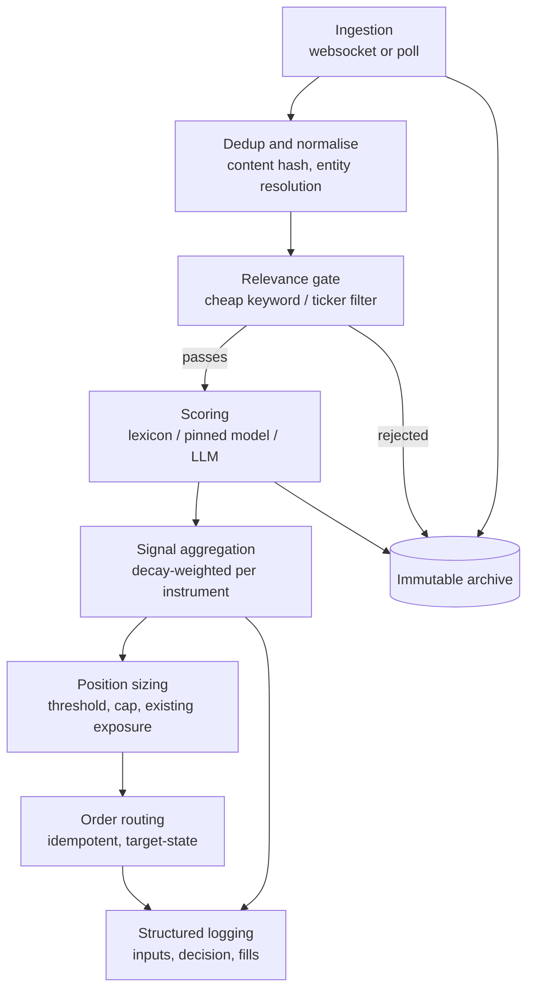

> **A strategy branch of [trading-experiments](../../tree/main).** This page is the complete
> write-up for one strategy. The shared backtest harness, setup instructions, the head-to-head
> benchmark across every strategy, and the execution notes all live on
> [`main`](../../tree/main) — this branch has that same code and those same results, it just
> leads with the strategy instead.
>
> Other strategies: [Donchian + Aroon](../../tree/strategy/donchian-aroon) &middot; [SMA + Momentum](../../tree/strategy/sma-momentum) &middot; [Seykota](../../tree/strategy/seykota) &middot; [EMA9 / RSI14](../../tree/strategy/ema-rsi-meanrev)
# Strategy 5 — Sentiment analysis (design plan, not implemented)

> [!IMPORTANT]
> **This strategy does not exist yet.** There is no implementation in `strategies/`, it is
> deliberately excluded from `run_benchmark.py`, and there are **no backtest numbers anywhere
> in this document** — not a Sharpe, not a CAGR, not a hit rate. Any figure quoted here for
> another strategy comes from the generated benchmark; nothing is quoted for this one because
> nothing has been measured.
>
> What follows is a **scaffold**: an architecture sketch and a decision map intended to be the
> input to a deeper plan later, not a specification to build from today. Where a choice is
> genuinely open it is marked as open rather than resolved with false confidence. Section 10
> collects the questions this document knowingly leaves unanswered.

Every other strategy in this repo reads one input: price. This one would read text. That single
difference changes the data problem, the cost model, the backtest's trustworthiness, and the
operational burden — all of them for the worse, and one of them (orthogonality) for the better.
Whether that trade is worth making is the question the staged plan in §9 exists to answer.

---

## Contents

- [1. What the strategy would be](#1-what-the-strategy-would-be)
- [2. Data feeds](#2-data-feeds)
- [3. The hard problem: backtesting sentiment honestly](#3-the-hard-problem-backtesting-sentiment-honestly)
- [4. Signal extraction](#4-signal-extraction)
- [5. Execution architecture](#5-execution-architecture)
- [6. Latency](#6-latency)
- [7. Cost optimisation](#7-cost-optimisation)
- [8. Pros and cons versus the other strategies here](#8-pros-and-cons-versus-the-other-strategies-here)
- [9. A staged plan](#9-a-staged-plan)
- [10. Open questions](#10-open-questions)

---

## 1. What the strategy would be

"Sentiment" is not one strategy. It covers at least four systems that share a name and share
almost nothing else — different data, different horizons, different failure modes:

| Variant | Signal | Typical horizon | Main difficulty |
|---|---|---|---|
| **News reaction / drift** | Scored tone of news articles about an instrument | Hours to ~5 days | Timestamp integrity; separating news from the price move that caused the coverage |
| **Social volume / momentum** | Posting volume and tone on Reddit, X, StockTwits | Minutes to days | Bots, promotion, deleted content, severe selection bias |
| **Earnings call / filing NLP** | Tone and language change in transcripts and 10-K/10-Q text | Days to weeks | Sparse events (≈4/yr/ticker); needs a wide universe for power |
| **Analyst revision sentiment** | Direction and dispersion of estimate revisions | Weeks to months | Data is expensive; the anomaly is well known and likely crowded |

### Recommended starting variant

**News reaction at a 1–5 day horizon.** For a solo researcher this is the only one of the four
where all of the following hold at once:

- **Timestamps are explicit and auditable.** Every article has a publication time you can
  inspect and reason about. Social archives frequently do not preserve this reliably, and
  filing-based signals depend on filing-time conventions that are their own study.
- **The horizon is long enough to be reachable.** At 1–5 days the strategy is not competing on
  latency (see §6), which removes an entire class of infrastructure requirement that a retail
  participant cannot satisfy anyway.
- **Event frequency is workable.** Enough events on a liquid universe to get statistical power
  within months, unlike quarterly filings.
- **It fits the harness that already exists.** A daily-bar signal drops into the repo's existing
  `run(signal, traded, warmup, **params) -> StrategyResult` interface and the same no-look-ahead
  convention. Nothing about the scoring pipeline needs to change how positions are simulated.
- **There is prior literature to argue with.** Post-announcement and post-news drift are among
  the most-studied effects in the field, which means the hypothesis arrives with a prior and a
  body of contrary evidence rather than as a blank guess.

Social sentiment is the more interesting variant and the worse first project: the data problems
in §2 and §3 are at their most severe there, and it is very easy to produce an impressive
backtest that is entirely an artefact of survivorship in the archive.

### The hypothesis, stated so it can be killed

> For a liquid instrument, news published at time *t* and scored on a tone axis carries
> information about the instrument's return over the following 1–5 trading days that is **not
> already contained in price**, with the sign of the return matching the sign of the tone score,
> after controlling for the contemporaneous move in the broad market and for the instrument's own
> recent return.

The clauses matter. "Not already contained in price" rules out the trivial result where negative
news correlates with a decline that already happened by the time the article was indexed.
Controlling for the market return rules out picking up beta. Controlling for recent own-return
rules out re-deriving the momentum and mean-reversion signals this repo already has.

**What falsifies it.** Conditional on a scored event, the distribution of forward returns is
statistically indistinguishable from the unconditional distribution — the conditional mean is
within noise of zero once the controls above are applied. This is measurable directly on an
archive, with no strategy, no position sizing, and no backtest engine, which is why §9 makes it
the gate before anything gets built.

**What it does not claim.** It says nothing about whether an edge, if present, survives costs,
capacity, or crowding. Those are later questions and each can kill a real effect independently.

---

## 2. Data feeds

Two properties dominate this decision and both are routinely overlooked in favour of coverage
and price:

**Point-in-time integrity.** Does the archive show what was knowable *at that timestamp*, or has
it been revised since? News archives are frequently rewritten: headlines get edited, stories get
corrected, tickers get re-tagged by the vendor's classifier after the fact, and the timestamp you
receive may be the *last modified* time rather than the *first published* time. An archive that
silently reflects later knowledge will produce a backtest that cannot be reproduced live, and the
failure is invisible — the numbers simply look good.

**Survivorship and selection bias.** This is most acute in social data. Deleted posts, banned
accounts, locked or removed subreddits, and platform-side spam filtering all mean a historical
pull returns *what survived*, not *what was posted*. Content that survives is systematically
different from content that does not, and the direction of that bias is not knowable after the
fact.

### News

| Source | What you actually get | History for backtest | Cost tier | Notes |
|---|---|---|---|---|
| **Alpaca news API** | Real-time and historical news, Benzinga-sourced, ticker-tagged | Multi-year, available with an account | Free with brokerage account | Easiest starting point if already using Alpaca; check current redistribution terms |
| **Polygon.io news** | Ticker-tagged articles with publisher metadata; some tiers include a vendor sentiment field | Depends heavily on tier | Free tier (rate-limited) → prosumer | Well-documented API; verify how far history goes on your specific tier |
| **Benzinga** | Direct from a primary financial news producer; fast, well-tagged | Good | Prosumer | Widely used by retail algo traders; the upstream for several resellers |
| **NewsAPI** | General-purpose news aggregation, not finance-specific | Free tier is development-only and heavily delayed/limited | Free → low | Weak ticker tagging; the free tier's delay makes it unusable for live signals |
| **GDELT** | Global event and tone database over worldwide news, updated on a short cycle | Very deep, free | Free | Enormous coverage and genuinely free, but noisy, not finance-specific, and mapping entries to tickers is your problem |
| **RavenPack / Bloomberg / Refinitiv** | Pre-scored, entity-resolved, explicitly point-in-time sentiment | Deep and properly constructed | Institutional | The correct tool. Priced for funds, not individuals. Worth knowing what "done properly" looks like even if unreachable |

### Social

| Source | What you actually get | History for backtest | Cost tier | Notes |
|---|---|---|---|---|
| **Reddit API** | Posts and comments from finance subreddits | Poor via API; third-party dumps exist with gaps | Free tier is restricted; commercial use is priced | Terms changed materially in 2023 — verify current limits before designing around it |
| **X / Twitter API** | Posts, cashtags, engagement metrics | Historical/full-archive access is a premium product | Became expensive in 2023 | Once the default social source; the pricing change removed it from realistic solo-researcher budgets |
| **StockTwits** | Retail messages with an explicit user-tagged bullish/bearish label | Varies | Free → low | The user-supplied labels are unusual and useful — a sentiment target that does not require a model |
| **Discord / Telegram scraping** | Whatever a given server contains | None, unless you capture it yourself | Free (labour) | Terms-of-service risk, no reproducibility, extreme selection bias. Not recommended |

### Filings and fundamentals

| Source | What you actually get | History for backtest | Cost tier | Notes |
|---|---|---|---|---|
| **SEC EDGAR full-text search** | Full filing text, authoritative filing timestamps | Deep (full-text search covers 2001 onward) | Free | The gold standard for point-in-time integrity — filings are immutable and timestamped by the regulator. Rate limits and a declared user-agent apply |
| **Earnings call transcripts** | Prepared remarks and Q&A | Varies by vendor | Low → prosumer | Q&A language is where the signal is usually claimed to be; prepared remarks are heavily managed |
| **Aggregated sentiment vendors** | A pre-computed score per ticker per day | Varies | Low → prosumer | Convenient and opaque. You inherit their model, their revisions, and their look-ahead bugs, and you cannot audit any of it |

### The honest summary

The free and low-cost options have the weakest point-in-time guarantees, and the sources with
strong guarantees are priced for institutions. **EDGAR is the one exception** — free, deep, and
genuinely immutable — which is a real argument for taking the filing-based variant more seriously
than its sparse event count first suggests.

For everything else, §3 describes the only fully trustworthy path available at this budget.

---

## 3. The hard problem: backtesting sentiment honestly

This section deserves more weight than any other in this document. The repo's existing strategies
have a backtest you can trust because the input is a split-adjusted daily close — a number that
is not revised, not re-tagged, and not re-scored by a model that has since been updated. None of
that is true of text.

Look-ahead leakage in a price-only backtest is a bug you can find by reading the code, and
[`tests/test_no_lookahead.py`](tests/test_no_lookahead.py) proves its absence mechanically by
truncation. In a sentiment backtest, leakage arrives through the *data* and through the *model*,
where no amount of careful coding will catch it.

### The four leakage channels

**1. Timestamp drift.** The time you receive is often not the time the information became
actionable. Vendors backfill. Articles are indexed minutes or hours after publication. Some feeds
return a last-modified time. A signal built on a timestamp that is systematically early — even by
minutes, on an intraday strategy — will backtest beautifully and fail live. *Mitigation:* prefer
sources with an explicit, documented, immutable publish time; measure the gap between claimed
publish time and your own observed arrival time on live data, and pad the backtest by that gap.

**2. Revision.** Headlines are edited, stories corrected, ticker tags reassigned by a classifier
that has since improved. An archive pulled today reflects the vendor's *current* understanding,
not the one available at the time. *Mitigation:* this cannot be fixed after the fact. It can only
be avoided by capturing prospectively.

**3. Model contamination — the one people miss.** If you score 2019 headlines with an LLM whose
training data runs through 2024, that model **already knows what happened**. It knows which
companies collapsed, which product launches failed, which rumours proved true. It is not
inferring tone from the text; it is partly recalling the outcome. This is not a hypothetical
mechanism, and it is entirely invisible in the code — the pipeline looks correct and the results
look excellent. *Mitigation:* use a model whose training cutoff precedes the test window, or use a
model with no world knowledge at all (a lexicon, §4), or accept that any LLM-scored historical
backtest is a weaker form of evidence and label it as such.

**4. Archive survivorship.** Covered in §2. Historical social pulls return surviving content.
Deleted, banned, and removed material is systematically different from what remains.

### The recommendation: capture point-in-time going forward

**Log your own feed live, timestamp it on arrival, store it immutably, and build the archive
prospectively.** Subscribe to the feed you intend to trade, write every document to append-only
storage with *your own* receipt timestamp alongside the vendor's claimed publish time, and let the
archive accumulate.

*For*: it is the only construction where the four channels above are closed by design. Your
receipt timestamp is by definition a time at which you actually possessed the information. Nothing
is revised, because you keep what you first saw. The model-contamination problem shrinks to a
question you control, because the archive postdates your model choice rather than predating it.

*Against*: it is slow. You wait months before you have enough events to test anything, and you
cannot shortcut it with money. That waiting period is real and is the single biggest practical
objection to this whole strategy.

*Verdict*: the waiting is the price of a backtest that means something. A purchased historical
archive lets you produce a result next week; prospective capture lets you produce a result you can
believe. Given that the failure mode of the fast path is *a convincing number that is wrong*, and
given that this is a research project rather than a business with a deadline, the slow path is the
right one.

A reasonable hybrid: use a purchased or free archive for **exploration only** — to size the
problem, build the pipeline, and decide whether the idea is worth the wait — while explicitly
treating any number it produces as indicative and not as evidence. Start prospective capture on
day one, in parallel, so the clock is already running.

---

## 4. Signal extraction

Turning a document into a number. Three families, and the choice is less about accuracy than
about reproducibility and cost.

| Approach | Cost per document | Latency | Reproducible? | Drift risk |
|---|---|---|---|---|
| **Lexicon** (VADER, Loughran–McDonald) | Effectively zero | Microseconds | Perfectly — it is a fixed word list | None |
| **Small fine-tuned transformer** (FinBERT-class) | Near zero after setup; local GPU/CPU | Milliseconds | Yes, if you pin the weights | None, if pinned |
| **LLM via hosted API** | Meaningful, and scales linearly with volume | Hundreds of ms to seconds, plus network | **No** — providers update models behind an endpoint | High |

**Lexicon methods** score by counting words against a list. VADER is general-purpose and handles
social text conventions (emphasis, negation, emoji). **Loughran–McDonald is finance-specific and
matters more than it sounds**: it was built precisely because general-purpose sentiment lexicons
misclassify financial language — words like "liability", "tax", "cost" and "capital" are negative
in ordinary English and neutral in a filing. A general lexicon applied to financial text produces
a systematically biased score.

*For*: free, instant, perfectly deterministic, and immune to model contamination (§3) because it
has no world knowledge whatsoever. *Against*: no understanding of context, negation at distance,
sarcasm, or the difference between a company's own guidance and a journalist's framing of it.

**Small fine-tuned transformers** (the FinBERT family) are trained on financial text and give
genuine contextual understanding at near-zero marginal cost once running locally. Pinned to a
specific checkpoint they are fully reproducible.

**LLM scoring via API** is the most capable and the worst research instrument. Two problems
compound: the model may be contaminated with respect to your test window (§3), and **the endpoint
is not stable** — providers update models without changing the name, so a score computed in March
may not be reproducible in September. A research result you cannot reproduce is not a result.

### The recommendation

**Pin a local model for the research loop, whatever you eventually run in production.** The
research loop demands determinism: you need to re-run a scoring pass and get identical numbers,
or you cannot tell whether a change in results came from your strategy change or from someone
else's silent model update.

A sensible progression:

1. Start with **Loughran–McDonald** as a baseline. It is free, instant, and contamination-proof.
   If the signal is not visible at all with a finance lexicon, that is a genuine and cheap
   negative result.
2. Move to a **pinned FinBERT-class model** if the lexicon shows something, or to test whether
   contextual understanding adds anything measurable over word counting.
3. Consider an **LLM** only for a clearly-scoped subset — ambiguous documents, or a
   quality-control comparison against the cheaper scorers — and record the exact model version
   with every score you store.

Store the raw document text alongside every score. Re-scoring an archive with a better model
later is cheap; re-acquiring documents you did not keep is impossible.

---

## 5. Execution architecture



| Component | Responsibility | Notes |
|---|---|---|
| **Ingestion** | Pull or receive documents; stamp arrival time | Your receipt timestamp is the one that matters (§3) |
| **Dedup / normalise** | Content-hash to drop reprints; resolve entities to tickers | Wire stories are syndicated across dozens of outlets — without dedup, one story becomes twenty and the aggregate signal is dominated by republication volume rather than information |
| **Relevance gate** | Cheap filter before expensive scoring | The single largest cost lever (§7) |
| **Scoring** | Document → number | Record the model version with every score |
| **Aggregation** | Many documents → one signal per instrument | Where decay, weighting, and the horizon choice live |
| **Sizing** | Signal → target position | Repo convention: risk via exits, not resizing |
| **Routing** | Target position → orders | Idempotency and reconciliation per `deploy/README.md` |
| **Logging** | One structured record per decision | Log the inputs, not just the decision |

The archive is written to from **ingestion**, not from scoring — including documents the relevance
gate rejects. Storing rejects is what makes the gate itself auditable and tunable later; a gate you
cannot re-tune without re-acquiring data is a gate frozen at its first guess.

### Streaming or batch?

**This is determined entirely by the horizon chosen in §1, and it should not be decided
independently.** It is the most common place where sentiment projects over-build.

| Horizon | Architecture | Justification |
|---|---|---|
| Minutes | Streaming, websocket push, always-on | The signal decays before a polling interval elapses |
| Hours | Streaming or frequent polling | Depends on measured decay — see §6 |
| **1–5 days (recommended)** | **Batch, once daily** | A once-a-day pass is entirely sufficient, and this repo's existing daily-bar deployment options apply unchanged |

At the recommended horizon the whole thing collapses to a scheduled job: pull the day's documents,
score, aggregate, decide, place one order. That is precisely the shape
[`deploy/README.md`](deploy/README.md) already covers, and every option in it — local cron, GitHub
Actions with an external pinger, Lambda + EventBridge, a small VM — remains valid without
modification.

The one genuine addition is **stateful storage**. The price strategies are stateless: they recover
everything they need from the broker position and a few hundred bars. A sentiment strategy owns an
archive that must persist and grow. That shifts the deployment calculus somewhat toward options
with durable storage attached (a VM with a disk, or a serverless function plus object storage)
and away from pure ephemeral runners.

Regenerating the charts, and checking the docs render correctly:

```bash
python make_charts.py               # rebuild results/charts/*.png
python tests/test_no_lookahead.py   # prove no strategy can see the future
python tests/check_markdown.py      # tables balanced, links resolve, mermaid parses
```

---

## 6. Latency

Latency deserves a rigorous answer because it is where this kind of project most often wastes
its effort. **The correct amount of latency engineering is a function of how fast the edge decays,
and that is an empirical quantity you can measure.**

| If the edge decays over… | You are competing with | Realistic verdict |
|---|---|---|
| Milliseconds | Colocated HFT firms with direct exchange feeds, FPGA parsing, and machine-readable news wires bought specifically for this | **You lose.** Not "it's hard" — the infrastructure gap is unbridgeable at retail. Do not enter this race |
| Seconds to minutes | Fast systematic desks and well-built retail systems | Contestable, but every millisecond of your stack matters and you are the slowest participant |
| **Hours to days** | Slower discretionary flow and the general market | **Latency is essentially irrelevant.** A few minutes either way changes nothing |

The recommended 1–5 day horizon sits firmly in the bottom row, which means the honest answer to
"how do I minimise latency?" is **you mostly do not need to**, and effort should go to data
quality and to §3 instead.

### Where latency actually accumulates

Listed in rough order of magnitude, which is usually the reverse of the order people optimise:

1. **Vendor publish delay** — the gap between an event occurring and your feed carrying it.
   Frequently seconds to minutes and **entirely outside your control**. On any sub-hour strategy
   this dominates everything else you could optimise, and it is set by which feed you buy.
2. **Polling interval** — if you poll every 5 minutes, your mean detection delay is ~2.5 minutes,
   dwarfing every downstream millisecond. Switching to websocket push is the single highest-value
   latency change available, and it is the only one worth making before measuring anything.
3. **Model inference** — microseconds for a lexicon, milliseconds for a small local transformer,
   hundreds of milliseconds to seconds for a hosted LLM plus network round-trip. Note that
   choosing an LLM API is simultaneously a latency decision and a reproducibility decision (§4).
4. **Order routing** — broker API round-trip and internal handling. Small, and largely fixed by
   your broker choice rather than your code.

### Measure decay before optimising anything

The prerequisite experiment, which is cheap and answers the whole question:

> For scored events in the archive, compute mean forward return over horizons of 5 minutes,
> 30 minutes, 1 hour, 1 day, 2 days, and 5 days. Plot how the conditional edge decays with
> horizon, and note where it is no longer distinguishable from noise.

If the edge is gone by the 1-day mark, the strategy needs infrastructure that is out of reach and
the correct decision is to stop. If it persists across days, latency work is wasted effort and
that conclusion is worth a great deal — it removes the most expensive part of the build.

This experiment also falls out of the Phase 2 gate in §9 almost for free, since it is the same
conditional-forward-return computation with the horizon varied.

---

## 7. Cost optimisation

### Where the money goes

| Driver | Scales with | Comment |
|---|---|---|
| Data subscription | Coverage and history depth | Usually the largest line item; a step function, not a dial |
| LLM inference | **Document volume** | Linear and unbounded if uncontrolled |
| Storage | Archive size over time | Text compresses extremely well; genuinely minor |
| Always-on compute | Uptime | Only if streaming; a daily batch job is nearly free |

**The structural problem: cost scales with document volume, not with account size.** A $200
account and a $200,000 account ingesting the same universe pay the same data and inference bill.
Every price-based strategy in this repo runs on free Yahoo data at zero marginal cost forever.
This is the single most important economic fact about the sentiment strategy, and it is why §8
concludes that account size — not curiosity — should drive the decision to build it.

### Levers, roughly in order of impact

1. **A cheap relevance gate before expensive scoring.** Keyword and ticker-mention filtering costs
   nothing and typically removes the large majority of a general news feed before it reaches a
   model. If an LLM is in the pipeline, this one change dominates every other optimisation. Store
   the rejects (§5) so the gate can be re-tuned without re-acquiring data.
2. **Cache by content hash.** Syndicated wire stories appear across many outlets with identical or
   near-identical text. Hash the normalised body and score each unique document once. This is
   simultaneously a cost lever and a correctness fix — without it, aggregate sentiment measures
   republication volume rather than information.
3. **Small local models for the bulk, large models only for ambiguity.** Score everything with a
   lexicon or pinned FinBERT; escalate to an LLM only for documents where the cheap scorers
   disagree or land near the decision threshold. Most documents are not close calls.
4. **Batch requests** where the API supports it, and prefer off-peak or batch-tier pricing if the
   horizon tolerates the delay. At a 1–5 day horizon it comfortably does.
5. **Serverless or spot compute.** A daily batch job has no business paying for an always-on
   instance. This only reverses if the horizon forces streaming.
6. **Start with one instrument, or one small sector universe.** Cost scales with universe size
   while statistical power scales more slowly. Proving the effect exists on a narrow universe is
   far cheaper than proving it broadly, and a negative result arrives sooner and cheaper too.

The general shape: **make the expensive step rare rather than making it cheap.** Filtering,
caching, and escalation-on-ambiguity all attack document count, which is the term the bill is
actually proportional to.

---

## 8. Pros and cons versus the other strategies here

For reference, the four **measured** strategies this design would have to compete with. Sentiment appears nowhere on this chart because nothing has been built or tested.


The measured strategies, for reference — all generated by `run_benchmark.py` on identical bars:

| Strategy | Sharpe | Data cost | Implementation | Backtest trustworthiness |
|---|---|---|---|---|
| Donchian + Aroon | 0.90 | Free | ~100 lines | High — mechanically verified |
| SMA + Momentum | 0.81 | Free | ~60 lines | High |
| Seykota (ATR-sized) | 0.49 | Free | ~90 lines | High |
| EMA9 / RSI14 mean reversion | 0.39 | Free | ~110 lines | High |
| **Sentiment** | **Unknown — not built** | **Paid** | **A pipeline, not a file** | **Low by default; see §3** |

### Full comparison

| Dimension | Price strategies (all four) | Sentiment |
|---|---|---|
| **Data cost** | Zero, forever | Recurring subscription plus inference; scales with document volume, not account size |
| **Implementation complexity** | One file, one function, no state | Ingestion, dedup, scoring, aggregation, storage, monitoring — a system |
| **Backtest trustworthiness** | High. No-look-ahead proven by truncation test | Low unless point-in-time capture is done properly (§3). Four leakage channels, several invisible in code |
| **Capacity** | High — liquid ETFs absorb far more than a retail account | Unknown, and depends on how many others trade the same feed |
| **Edge decay / crowding** | Trend following is publicly known and has persisted for decades | Faster. Cheaper NLP each year means more participants; vendor-scored feeds are read by everyone who buys them |
| **Operational burden** | One scheduled job; a missed run is the main risk | Continuous ingestion, an archive that must not be lost, model versioning, vendor dependency |
| **Falsifiability** | Very high — a parameter sweep answers it in minutes | High in principle (§1), but only after months of data capture |
| **Time to first honest result** | Minutes | Months |

### The case for building it

- **It is genuinely orthogonal.** All four existing strategies read exactly one input: price.
  They are correlated by construction — different functions of the same series — which caps how
  much diversification the set can ever provide. Text is an actual second information source, and
  a signal with genuinely low correlation to the existing four would be worth more than its
  standalone Sharpe suggests. This is the strongest argument by a wide margin.
- **Faster regime response, potentially.** The winning trend strategy exits on a 63-day channel
  break. That is deliberately slow, and the Donchian write-up's limitations section is explicit
  that the slow exit hands back large open profits by construction. News could in principle react
  in days rather than quarters. Whether it does so *profitably* is exactly the open question.
- **A much larger design space.** Price strategies on one instrument are close to exhausted — the
  Donchian sweep found a broad plateau and little else. Text has far more room, which is
  attractive if the interest is research rather than return.
- **The skills transfer.** NLP pipeline, point-in-time data discipline, and cost-controlled
  inference are useful well beyond this repo.

### The case against

- **The cost/return asymmetry on a small account is brutal.** A fixed monthly data bill against a
  small account is a guaranteed negative expected return unless the edge is large. The price
  strategies have literally zero marginal cost. This is not a close call at small account sizes.
- **The backtest is very easy to fool, and the failure is silent.** §3's four leakage channels all
  produce *better-looking* results. The repo's existing look-ahead test cannot help — it verifies
  the simulation loop, not the provenance of the input. Every convincing number would need a
  provenance argument attached, and most would not survive one.
- **The trend research points away from signal sophistication.** The most robust finding in this
  entire repo is that `exit_len` dominated everything — the *exit rule*, not the entry signal,
  determined the outcome, while entry length barely registered. Sentiment is an elaborate entry
  signal. If the existing evidence says entries are not where the returns live, the prior on an
  expensive new entry signal should be correspondingly low.
- **Nothing here beat buy-and-hold SMH (1.02 Sharpe).** That is the benchmark any new strategy
  actually has to clear, and four serious attempts did not.

### When it would be the right project

Fairly stated, this is not a bad idea — it is an ill-matched one at the current account size. It
becomes the right project when at least one of these holds:

1. **The research interest is genuine.** If the goal is to learn NLP and point-in-time data
   engineering, the strategy's expected return is beside the point and this is a good vehicle.
2. **The account is large enough for fixed costs to be immaterial.** The arithmetic reverses
   entirely once a subscription is a rounding error against the position size.
3. **There is willingness to capture prospectively for months before trading anything.** This is
   the real test. Someone who will run ingestion for six months before placing a single order will
   get a trustworthy answer. Someone who will not should not start, because the fast path produces
   a number that cannot be believed — and an unbelievable number is worse than no number, since it
   invites capital.

---

## 9. A staged plan

Each phase has an explicit go/no-go gate. The point of the structure is that **most of the cost
sits in Phases 3–5, and most of the information sits in Phase 2** — so the plan is arranged to
reach the decisive evidence before spending the money.

### Phase 0 — Decide and write it down

Pick the variant (§1 recommends news reaction, 1–5 day horizon). Pick the universe. Write the
falsifiable hypothesis and the specific condition that would kill it, **before** looking at any
data.

*Gate:* a written hypothesis with a stated falsification condition, and a universe small enough to
be affordable. If the hypothesis cannot be stated in a form that could fail, stop.

### Phase 1 — Capture, prospectively

Stand up ingestion only: subscribe, receive, stamp arrival time, dedup, store immutably. **No
scoring, no strategy, no trading.** Score nothing yet — but keep every raw document so it can be
scored later with a model chosen later.

Run for long enough to accumulate a meaningful number of events. The right duration is set by
event frequency on the chosen universe, not by the calendar: enough events to detect a plausible
effect size, which for a narrow universe is likely several months.

*Gate:* an archive with verified arrival timestamps and no gaps, plus a measured distribution of
the delay between vendor publish time and your receipt time (this number feeds §6 and the backtest
padding).

### Phase 2 — Does sentiment predict anything at all? **← the real gate**

The decisive phase, and the cheapest. No strategy, no position sizing, no backtest engine — just
the conditional relationship:

- Score the archive (start with Loughran–McDonald, §4).
- Compute forward returns at 5 min / 30 min / 1 h / 1 d / 2 d / 5 d after each scored event.
- Test whether the conditional distribution differs from the unconditional one, **after
  controlling for the contemporaneous market return and the instrument's own recent return** —
  otherwise you will rediscover beta or the momentum signal this repo already has.
- Report effect size with a confidence interval, not just a p-value, and be explicit about how
  many hypotheses were tested. Testing six horizons across several scoring methods is a multiple
  comparisons problem, and the correction is not optional.

*Gate:* a conditional effect that is **statistically credible, correctly signed, and economically
meaningful after plausible costs**. All three, not any one.

> **Most such projects should stop here, and stopping is a successful outcome.** A clean negative
> result after Phase 2 has cost a few months of passive data capture and no infrastructure, and it
> is worth writing up — a documented negative is exactly the kind of thing this repo already
> publishes (see the Aroon filter finding in the main README).

### Phase 3 — Backtest, under the repo's conventions

Only if Phase 2 passes. Implement as a `strategies/` module with the standard interface, so it is
scored by the same harness, same costs, same warm-up, same IS/OOS split as everything else. Pad
entry timing by the publish-to-receipt delay measured in Phase 1.

*Gate:* clears the existing strategies on an out-of-sample basis, and — the harder test — clears
buy-and-hold SMH at 1.02 Sharpe. Correlation to the existing four should be measured here too; a
lower-Sharpe but genuinely uncorrelated signal may still be worth having, and that is a legitimate
reason to pass this gate on different grounds.

### Phase 4 — Paper trade

Run live against the real feed, placing no real orders. This is where backtest-vs-live divergence
surfaces: feed outages, schema changes, duplicate documents, tickers tagged differently in
real time than in the archive.

*Gate:* live signals match what the backtest would have produced on the same days, within a stated
tolerance. A parity test in the spirit of the repo's existing one — same code path for research and
live, verified rather than assumed.

### Phase 5 — Decide

Deploy with real money, shelve it, or write up the negative result. All three are legitimate
outcomes, and the plan is explicitly designed so that arriving at "no" cheaply counts as success.

---

## 10. Open questions

Deliberately unresolved. These are the inputs to the deeper plan, not oversights:

**Scope and universe**
- One instrument, the existing semiconductor pair (continuity with the repo, but few events), or a
  broader liquid universe (statistical power, but higher cost and a different research question)?
  This is a genuine tension between power and continuity and is not resolved here.
- Sector-level or single-name sentiment? The repo trades a sector ETF, but most news is
  company-specific — how company news aggregates to a sector view is an open modelling question.

**Signal construction**
- How should multiple documents in a window aggregate — mean, volume-weighted, decay-weighted,
  or extremes only? Untested.
- Does *volume* of coverage carry information independent of *tone*? Plausible and unexamined.
- Should the signal be directional (long/short) or a filter on an existing trend strategy? The
  second is cheaper to validate and may be the better first use.

**Interaction with what already exists**
- Does sentiment add anything *after* controlling for the price signals already in the repo? This
  is the question that actually matters for a portfolio, and it is stricter than standalone
  significance.
- Would it be better deployed as an **exit** rule than an entry? Given that `exit_len` dominated
  the trend research, this may be the highest-value framing and it inverts the usual assumption.

**Practical**
- Which specific feed, once current terms and history depth are verified? All §2 pricing and
  access details need checking against current vendor documentation before any commitment.
- How long must Phase 1 run? Set by event frequency and target effect size; requires a power
  calculation not done here.
- What is the minimum account size at which the fixed cost is defensible? Should be computed
  explicitly from the subscription cost and a conservative edge estimate before anything is
  purchased.
- Redistribution and licensing: what can be published in a public research repo? Most vendor
  terms restrict redistribution of raw content, which constrains what results can be shared.

---

*No results are reported in this document because none have been produced. If this strategy is
ever built, its numbers will be generated by `run_benchmark.py` like every other strategy here,
and this file will be updated to point at them.*

---

## Glossary

Abbreviations used on this page. The repo-wide list, covering every term used anywhere in this project, is in [`GLOSSARY.md`](GLOSSARY.md) — it is available on every branch.

| Term | Definition |
|---|---|
| **Sharpe ratio** | Return per unit of volatility (annualised mean daily return / annualised standard deviation), at a 0% risk-free rate. ~1.0 is respectable. |
| **CAGR** | Compound Annual Growth Rate - the average yearly compounded return. |
| **Max DD (drawdown)** | Worst peak-to-trough decline. -75% means the account fell to a quarter of its previous high. |
| **IS / OOS** | In-sample (2012-2019, used for tuning) vs out-of-sample (2020-2026, held back). A large drop from IS to OOS indicates overfitting. |
| **Vol** | Annualised standard deviation of daily returns - how much the value bounces around. |
| **bps** | Basis points - hundredths of a percent. 5 bps = 0.05%. |
| **Exposure** | Share of days actually holding a position rather than sitting in cash. |
| **Round trip** | One complete buy-then-sell cycle, i.e. two trades. |
| **SMH / SOXL / SPY** | VanEck Semiconductor ETF (the signal instrument) / Direxion Daily Semiconductor Bull 3x (the traded instrument) / SPDR S&P 500 ETF (the broad-market benchmark). |
| **B&H** | Buy and hold - the do-nothing benchmark. |
| **NLP / LLM** | Natural Language Processing / Large Language Model - computational analysis of text, and the general-purpose text models used to do it. |
| **Point-in-time (PIT)** | Data reflecting what was actually knowable at a given timestamp, rather than a later revised version. |
| **Model contamination** | Scoring historical text with a model whose training data postdates it, so it already knows what happened. Invisible look-ahead. |
| **Survivorship bias** | Drawing conclusions only from what survived - deleted posts, delisted firms - which systematically flatters results. |
| **VADER / FinBERT / Loughran-McDonald** | A general-purpose sentiment lexicon / a family of finance-tuned transformer models / a sentiment word list built specifically for financial text. |
| **HFT / colocation** | High-Frequency Trading / placing servers next to an exchange to cut latency. |
| **Streaming vs batch** | Processing data continuously as it arrives, versus in scheduled chunks. |
