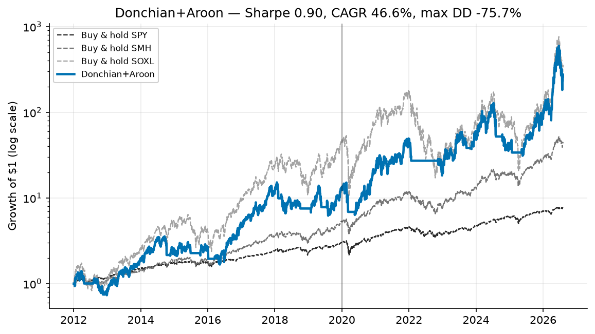

> **A strategy branch of [trading-experiments](../../tree/main).** This page is the complete
> write-up for one strategy. The shared backtest harness, setup instructions, the head-to-head
> benchmark across every strategy, and the execution notes all live on
> [`main`](../../tree/main) — this branch has that same code and those same results, it just
> leads with the strategy instead.
>
> Other strategies: [SMA + Momentum](../../tree/strategy/sma-momentum) &middot; [Seykota](../../tree/strategy/seykota) &middot; [EMA9 / RSI14](../../tree/strategy/ema-rsi-meanrev) &middot; [Sentiment (design)](../../tree/strategy/sentiment)
# Strategy 1 — Donchian channel breakout with an Aroon market filter

Implementation: [`strategies/donchian_aroon.py`](strategies/donchian_aroon.py)
Benchmark harness: [`run_benchmark.py`](run_benchmark.py)

---

## 1. The strategy

### Origin

The rules come from the r/algotrading post
["Strategy 1: Trend Following"](https://www.reddit.com/r/algotrading/comments/y1cx72/strategy_1_trend_following/),
which specifies the system as:

| Component | Rule as posted |
|---|---|
| Input | Closing prices for the last `x` periods on timeframe `t` (e.g. last 50 closes, daily) |
| Market filter | Trade using the Aroon indicator — the strategy performs in trending markets and underperforms in sideways ones |
| Buy trigger | Buy when the asset reaches **above the high for the period `x`** |
| Sell trigger | Sell when the asset reaches **below the low for the period `x`** |
| Asset classes | Securities in the S&P 500 |
| Optimization | Parameters are given as examples and should be tuned per timeframe and platform |

This is a Donchian channel breakout — the classic Turtle-style structure — with a trend
filter bolted onto the entry.

### The two adaptations we made

Both are deviations from the post. They are stated up front because they change what the
results mean.

**1. Universe: S&P 500 cross-section → a single signal/traded pair.**
The post scans 500 names and presumably trades a basket. The account this research targets
is roughly $200. A 500-name cross-sectional scan is not implementable at that size: there is
no capital to diversify across, and per-name spread costs would swamp the edge. Instead we
keep one pair:

- **Signal instrument: SMH** (VanEck Semiconductor ETF) — the clean, unleveraged trend read.
- **Traded instrument: SOXL** (Direxion Daily Semiconductor Bull 3×) — the same sector at 3×
  daily leverage.

The trend is read on SMH and expressed in SOXL. SOXL's own price is too noisy, and decays too
much in chop, to read a channel off directly. This concentration is a real limitation — see
§6.

**2. Channel computed on closes, not intraday highs/lows.**
The post says "closing prices for the last x period", so the channel bounds are built from
closes. Many Donchian implementations use intraday highs and lows instead. Using closes is
both faithful to the source and consistent with the daily-close fills this harness models. It
produces a less twitchy channel than a high/low version would.

---

## 2. The math

### Notation

Let $C_t$ be the closing price of the **signal** instrument (SMH) on day $t$, and let
$N_{\text{entry}}$, $N_{\text{exit}}$, $A$ be the entry channel, exit channel, and Aroon
lookback lengths.

### Donchian channel bounds

$$U_t = \max\left(C_{t-1},\, C_{t-2},\, \dots,\, C_{t-N_{\text{entry}}}\right)$$

$$L_t = \min\left(C_{t-1},\, C_{t-2},\, \dots,\, C_{t-N_{\text{exit}}}\right)$$

In code:

```python
upper = signal.rolling(entry_len).max().shift(1)
lower = signal.rolling(exit_len).min().shift(1)
```

**The `.shift(1)` is the no-look-ahead guard and it is load-bearing.** The bounds must be
built from the *prior* `x` closes, excluding today. Without the shift, today's close is a
member of its own channel, so $C_t > U_t$ becomes impossible and the entry trigger can never
fire. This is the single most common way to silently break a breakout backtest.

### Aroon Up / Down

Over a window of $A+1$ closes **ending at the current bar**, let $h_t$ be the number of bars
since the highest close in that window and $l_t$ the number of bars since the lowest:

$$\text{AroonUp}_t = 100 \cdot \frac{A - h_t}{A}
\qquad
\text{AroonDown}_t = 100 \cdot \frac{A - l_t}{A}$$

100 means the extreme is today; 0 means it is $A$ bars back. The market filter is:

$$\text{Trending}_t = \left(\text{AroonUp}_t > \text{AroonDown}_t\right) \;\wedge\; \left(\text{AroonUp}_t \geq \theta\right)$$

where $\theta$ is `aroon_thresh`.

### Triggers

$$\text{Breakout}_t = \left(C_t > U_t\right) \wedge \text{Trending}_t
\qquad
\text{Breakdown}_t = \left(C_t < L_t\right)$$

Note the asymmetry: the Aroon filter gates **entries only**. Exits are unconditional — once
the exit channel breaks, the position closes regardless of what any indicator says.

### The state machine

The signal is **stateful**, which is the structural difference between this and a regime
filter. The two triggers are independent, and neither implies the other. Position state
$s_t \in \{\text{flat}, \text{long}\}$ evolves as:

| Current state | Condition | Next state |
|---|---|---|
| flat | $\text{Breakout}_t$ | long |
| flat | otherwise | flat |
| long | $\text{Breakdown}_t$ | flat |
| long | otherwise | long |

```python
target = (not breakdown[day]) if holding else breakout[day]
```

Between a breakout and the next breakdown there is a genuine **third state: do nothing**. The
position is held through chop, unconditionally, until the exit channel actually breaks. A
regime filter like `close > SMA(200)` has no such state — it is a pure function of today's
price, so it flips in and out every time price oscillates around the line.

That patience is where the return comes from, and it is also why turnover is so low (§5).

### Return accounting and the no-look-ahead convention

Every strategy in this repo obeys one rule, implemented in `common/engine.py`: **signals are
computed from data up to and including today's close, and the resulting position earns
tomorrow's return.** Concretely, each day the loop:

1. Books today's return on the position it was **already** holding coming into today.
2. *Then* decides the position to carry into tomorrow, from signals as of today's close.

Costs are charged on the day the position changes:

$$r^{\text{strat}}_t = s_t \cdot r^{\text{traded}}_t - c \cdot \mathbb{1}\left[s_{t+1} \neq s_t\right]$$

with $c = 5\text{ bps}$ per side (`COST_PER_SIDE = 0.0005`), modelling spread plus slippage.
These are liquid ETFs and commissions are zero at the target broker. A 252-day warm-up is
discarded so every strategy is scored on identical bars.

### Metric conventions

- **Sharpe**: arithmetic mean daily return annualized by 252, divided by annualized daily
  standard deviation, at a **0% risk-free rate**. At a ~4% risk-free rate every Sharpe here
  drops by roughly `0.04 / vol`.
- **CAGR**: geometric, from the compounded equity curve.
- **Max drawdown**: measured on daily closes. True intraday drawdowns were worse.

Sharpe is a poor summary statistic for a leveraged trend follower — the return distribution is
fat-tailed and skewed, so one number hides a great deal. It is reported here because it was the
stated selection criterion, not because it is sufficient.

Regenerating the charts, and checking the docs render correctly:

```bash
python make_charts.py               # rebuild results/charts/*.png
python tests/test_no_lookahead.py   # prove no strategy can see the future
python tests/check_markdown.py      # tables balanced, links resolve, mermaid parses
```

---

## 3. Results


Growth of $1 on a log scale, so equal vertical distances are equal percentage moves. Benchmarks are dashed and grey; the out-of-sample period begins at the vertical line.



Backtest period **2012-01-03 → 2026-08-05** (3,668 trading days), signal SMH / traded SOXL,
5 bps per side, Sharpe at 0% risk-free. In-sample is before 2020-01-01; out-of-sample is
2020-01-01 onward.

These are **backtest results, not forecasts.** See §6 before reading anything predictive into
them.

### Headline

| Strategy | Sharpe | IS | OOS | CAGR | Vol | MaxDD | Growth | Exposure | Round trips/yr |
|---|---|---|---|---|---|---|---|---|---|
| **Donchian+Aroon** | **0.90** | 0.86 | 0.97 | 46.6% | 71.8% | −75.7% | 262.0× | 79% | 0.9 |
| SMA+Momentum (incumbent) | 0.81 | — | — | 38.0% | — | −74.2% | — | — | 4.0 |
| Seykota (ATR risk-sized) | 0.49 | — | — | 5.2% | — | −16.1% | — | — | — |
| Buy & hold SMH | 1.02 | — | — | 29.7% | — | −45.3% | — | 100% | — |
| Buy & hold SOXL | 0.90 | — | — | 49.1% | — | −90.5% | — | 100% | — |

Reading this table honestly:

- It beats the incumbent SMA+Momentum model on Sharpe (0.90 vs 0.81) and CAGR (46.6% vs 38.0%)
  at essentially the same drawdown (−75.7% vs −74.2%).
- **It does not beat buy & hold SMH on Sharpe** (0.90 vs 1.02). Unleveraged buy-and-hold of the
  sector is the better risk-adjusted vehicle. It is a different mandate — 29.7% CAGR and a
  −45.3% drawdown — but anyone optimizing purely for Sharpe should note that the simplest
  possible strategy wins that contest here.
- It matches buy & hold SOXL on Sharpe (0.90 vs 0.90) with meaningfully less drawdown
  (−75.7% vs −90.5%) and lower CAGR (46.6% vs 49.1%). The trend filter is buying drawdown
  reduction, not return.
- OOS (0.97) came in above IS (0.86). That is reassuring but not proof — see the overfitting
  discussion in §5.

### Regime consistency

Sharpe within fixed four-year blocks:

| Period | Sharpe |
|---|---|
| 2012–2015 | 0.71 |
| 2016–2019 | 0.99 |
| 2020–2023 | 0.88 |
| 2024–2027 | 1.09 |

No block is negative and none collapses. The weakest block (0.71) is still respectable. This
consistency across four distinct regimes is a stronger argument for the strategy than the
headline Sharpe is.

### Derived characteristics

At 79% exposure and ~0.9 round trips per year over 14.6 years, the average holding period is
roughly

$$\frac{3668 \times 0.79}{0.9 \times 14.6} \approx 220 \text{ trading days} \;(\sim 10 \text{ months})$$

This is a long-horizon system that happens to be evaluated daily. It is in the market about
four days in five, and it makes roughly one decision a year that matters.

---

## 4. Recommended setup

### Parameters

| Parameter | Value | Rationale |
|---|---|---|
| `entry_len` | 50 | Mid-plateau. The result is close to insensitive to this — see §5. |
| `exit_len` | 63 | The ridge of the sweep (~one calendar quarter of trading days). **This is the parameter that matters.** |
| `aroon_len` | 50 | Kept for fidelity to the source post. **Inert at these values — see the warning below.** |
| `aroon_thresh` | 50 | Same. |

### Important: the Aroon filter is inert at the recommended defaults

Because `aroon_len (50) <= entry_len (50)`, the market filter **never vetoes an entry** at the
shipped configuration. The proof is in §5, but the short version: a close that sets a new
50-day high is necessarily the maximum of any window that short, so `AroonUp` is pinned at 100
on every breakout bar, `AroonDown < 100`, and `Trending` is always true.

So at the recommended parameters this strategy reduces to a **pure Donchian 50/63 breakout
system**. The Aroon machinery is retained because it is in the source rules and because it
becomes active if you lengthen `aroon_len` past `entry_len` — but do not believe you are
getting a trend filter's protection at the defaults. You are not.

This is disclosed rather than quietly fixed because the honest finding is that the filter, as
literally specified in the post, does nothing.

### What to tune, and what to leave alone

**Tune `exit_len`.** It is by a wide margin the highest-leverage parameter. Median Sharpe rises
monotonically with it up to ~63 days and then flattens (§5). If live results disappoint, this
is the number to re-examine.

**Do not bother tuning `entry_len`.** Across the sweep it barely moves the result. Time spent
optimizing it is time spent fitting noise.

**If you want the Aroon filter to actually do something**, set `aroon_len` well above
`entry_len` (100–252) so it functions as a longer-horizon regime read. Note that in our testing
this did not improve results — the configurations selected that way had worse OOS performance.

### Account and instrument suitability

This configuration is appropriate for:

- A **designated speculative sleeve** whose owner has explicitly accepted a −76% drawdown. Not
  a core holding, not retirement capital.
- A **small cash account**. At ~0.9 round trips per year the strategy sits far inside T+1
  settlement and good-faith-violation constraints. A cash account that trades a settled-funds
  position roughly once a year will essentially never trip a GFV — whereas the incumbent
  SMA+Momentum model, at 4.0 round trips per year, has meaningfully more exposure to that rule.
  This is a genuine operational advantage and, unlike the Sharpe difference, it is not a
  statistical artifact.
- **Fractional-share brokers**, since a ~$200 account cannot buy a meaningful whole-share SOXL
  position.

It is **not** appropriate for anyone who needs the capital, anyone who will intervene manually
during a drawdown, or anyone treating it as a diversified strategy — it is one instrument in
one sector.

---

## 5. The research

### Method

A grid sweep over **336 parameter combinations**:

| Parameter | Values swept |
|---|---|
| `entry_len` | 20, 30, 40, 50, 63, 80, 100, 126 |
| `exit_len` | 20, 30, 40, 50, 63, 80, 100 |
| `aroon_len` | 25, 50, 100, 150, 200, 252 |

Each combination was scored with a fixed 252-day warm-up so all parameter sets are evaluated on
identical days, and split into in-sample (before 2020-01-01) and out-of-sample (2020 onward).

**The IS→OOS Spearman rank correlation across the grid was 0.643.** Parameter rankings carry
from one half to the other, but noisily. That number is the honest ceiling on how much any
in-sample optimization here should be trusted.

### Finding 1 — the Aroon filter is a mathematical no-op when `aroon_len <= entry_len`

A breakout requires $C_t > \max(C_{t-1}, \dots, C_{t-N_{\text{entry}}})$, i.e. today's close is
the highest of the last $N_{\text{entry}}+1$ closes. The Aroon window spans $A+1$ closes ending
today. If $A \leq N_{\text{entry}}$, today's close is necessarily the maximum of that window
too, so:

$$h_t = 0 \implies \text{AroonUp}_t = 100$$

and $\text{AroonDown}_t < 100$ unless every close in the window is identical. Therefore
`Trending` is true on **every** breakout bar, and the filter cannot veto anything.

This was confirmed empirically before it was derived: Aroon lengths of 14, 25 and 50 produced
**byte-identical** results for every `entry_len >= 50`. The filter only does real work as a
longer-horizon regime read.

This matters beyond this repo. The source post specifies Aroon as the market filter without
specifying its lookback relative to the channel length, and the natural reading — use the same
`x` for both — produces a filter that does nothing at all.

### Finding 2 — `exit_len` dominates; `entry_len` barely registers

Median all-period Sharpe across the grid, grouped by exit channel length:

| `exit_len` | Median Sharpe |
|---|---|
| 20 | 0.475 |
| 30 | 0.538 |
| 40 | 0.646 |
| 50 | 0.761 |
| **63** | **0.805** |
| 80 | 0.773 |
| 100 | 0.745 |

Monotonic increase to 63, then a gentle decline. Grouping the same grid by `entry_len` produces
a nearly flat profile.

The interpretation is that **the exit is the strategy**. How long you are willing to hold
through adverse movement determines the outcome; where exactly you got in does not. This also
means risk here is managed by *holding period*, not by position sizing or stop placement.

A broad, smooth, monotonic ridge is also the best available evidence that this is a real
structural effect rather than a fitted artifact. A spiky optimum would be the opposite signal.

### Finding 3 — adding a 200-day SMA regime filter makes it worse

An obvious "improvement" is to stack the incumbent's regime filter on top: require
`close > SMA(200)` for entries, and treat losing the SMA as an additional exit. Tested:

| Variant | Sharpe | IS | OOS | CAGR | MaxDD |
|---|---|---|---|---|---|
| Donchian+Aroon | **0.90** | 0.86 | 0.97 | 46.6% | −75.7% |
| Donchian+Aroon + SMA(200) overlay | 0.78 | 0.64 | 0.93 | 34.6% | −80.4% |

Worse Sharpe, worse CAGR, **and a worse drawdown**. The second exit cuts good trends short
without buying protection: the channel exit already performs that job, and the two fire at
different times, so the combination exits early on trends that would have recovered.

The lesson generalizes — stacking exits is not additive risk control.

### Finding 4 — the headline is the good corner, and naive optimization overfits

This is the most important section, and it is deliberately stated against the strategy's
interest.

**The 0.90 is not the centre of its parameter neighbourhood.** Across the 48 parameter sets
adjacent to the chosen configuration:

| Statistic | Value |
|---|---|
| Median all-period Sharpe | 0.83 |
| Sets beating the incumbent's 0.81 | 26 of 48 |
| Chosen configuration | 0.90 |

So a fair statement of the improvement is *"a modest, consistent Sharpe improvement over the
incumbent, plus a ~4× turnover reduction"* — **not** *"0.90 versus 0.81"*. Roughly half the
nearby configurations do not beat the incumbent at all.

**Naive in-sample optimization actively overfits on this problem.** Selecting the
top-in-sample-Sharpe configuration produced out-of-sample Sharpe in the **0.68–0.71** range —
worse than the incumbent. The in-sample peak was a spike, not a plateau. This is why the
selected parameters come from the broad ridge (Finding 2) rather than from the argmax, and why
the Spearman figure of 0.643 is quoted rather than buried.

**The durable win is turnover, not Sharpe.** Going from 4.0 to 0.9 round trips per year is a
~4× reduction. Unlike a 0.09 Sharpe difference measured on one sector over 14 years, that is not
a statistical artifact — it is a structural property of holding through chop, and it translates
directly into lower cost drag and lower good-faith-violation risk on a small cash account.

If you take one thing from this research, take Finding 1 and Finding 2. They are facts about the
mechanics. The performance edge is real but modest and sample-dependent.

---

## 6. Limitations and risks

**The −76% drawdown is inherent and cannot be engineered away.** Prior calibration work on this
account tested stop ladders exhaustively: no stop configuration tames the drawdown without
gutting returns. A daily stop cannot outrun a 3× gap-down, and trailing stops whipsaw. Finding 3
above is another instance of the same result. Deep drawdowns are the cost of holding 3× leverage
through trends — plan for losing three-quarters of the position, because history says it happens.

**Leveraged-ETF decay.** SOXL resets its 3× exposure daily. In choppy, non-trending tape it bleeds
relative to 3× the index return. The trend filter avoids some of the worst chop but does not
eliminate decay. Do not expect naive 3×-of-SMH returns.

**Slow exits hand back large open profits by construction.** A 63-day low is a long way down on a
3× instrument. The wide exit is exactly what produces the Sharpe (Finding 2), but it guarantees
that a substantial unrealized gain is surrendered before the exit fires. This is designed
behaviour, not malfunction — but it is psychologically difficult to hold through, and an operator
who overrides it manually is running a different strategy.

**Parameters are fitted to the best semiconductor decade in history.** The 2012–2026 sample covers
an extraordinary secular bull market in semis. The plateau structure (Finding 2) is reassuring
about robustness *within* this sample, but the plateau itself was measured on one sector in one
era. There is no evidence here about how it behaves in a flat or secularly declining semis regime
— the strategy would sit in cash for long stretches, earning nothing.

**Single-instrument concentration.** This is one sector expressed through one leveraged ETF. There
is no diversification of any kind. The original post's S&P 500 universe would have spread this
risk; our adaptation deliberately does not, because the target account is too small to.

**Daily-close fills are assumed.** The backtest signals and fills on daily closes. A live
implementation submitting market orders near the close will get a slightly different price. The
5 bps/side cost model is intended to absorb this, but a gap open through the exit channel would
fill materially worse than modelled — the drawdown figures are therefore optimistic.

**Sharpe as selection criterion.** Sharpe penalizes upside and downside volatility equally, which
is a poor fit for a positively-skewed trend follower. It was used because it was the stated
criterion. A reader optimizing for something else (Calmar, Sortino, terminal wealth) would
plausibly select different parameters.

**Survivorship of the instruments themselves.** SOXL and SMH both existed and remained liquid
across the whole sample. Leveraged ETFs do get closed after severe drawdowns; that risk is not
modelled anywhere in these results.

---

## Glossary

Abbreviations used on this page. The repo-wide list, covering every term used anywhere in this project, is in [`GLOSSARY.md`](GLOSSARY.md) — it is available on every branch.

| Term | Definition |
|---|---|
| **Sharpe ratio** | Return per unit of volatility (annualised mean daily return / annualised standard deviation), at a 0% risk-free rate. ~1.0 is respectable. |
| **CAGR** | Compound Annual Growth Rate - the average yearly compounded return. |
| **Max DD (drawdown)** | Worst peak-to-trough decline. -75% means the account fell to a quarter of its previous high. |
| **IS / OOS** | In-sample (2012-2019, used for tuning) vs out-of-sample (2020-2026, held back). A large drop from IS to OOS indicates overfitting. |
| **Vol** | Annualised standard deviation of daily returns - how much the value bounces around. |
| **bps** | Basis points - hundredths of a percent. 5 bps = 0.05%. |
| **Exposure** | Share of days actually holding a position rather than sitting in cash. |
| **Round trip** | One complete buy-then-sell cycle, i.e. two trades. |
| **SMH / SOXL / SPY** | VanEck Semiconductor ETF (the signal instrument) / Direxion Daily Semiconductor Bull 3x (the traded instrument) / SPDR S&P 500 ETF (the broad-market benchmark). |
| **B&H** | Buy and hold - the do-nothing benchmark. |
| **Donchian channel** | The highest and lowest close over the last n bars. A breakout is a close above the upper band; a breakdown is a close below the lower. |
| **Aroon** | An indicator measuring how recently the highest high and lowest low occurred in a lookback window. AroonUp = 100 means today set the highest price. |
| **Stateful signal** | A signal that depends on whether you already hold a position, so it can do nothing between an entry and an exit trigger. |
| **Plateau (in a sweep)** | A broad region of parameter values that all perform similarly. Evidence of a real effect, as opposed to an isolated spike. |
| **Spearman correlation** | Correlation measured on ranks. Used to ask whether parameters that ranked well in-sample also ranked well out-of-sample. |
